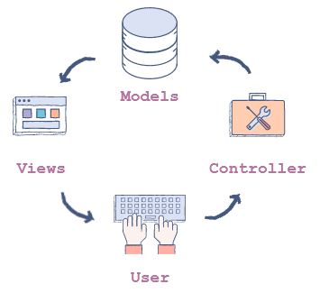

# Flask

- [Flask](#flask)
  - [Introduction to Flask](#introduction-to-flask)
    - [Model-Template-View Architecture](#model-template-view-architecture)
    - [WSGI and Jinja2](#wsgi-and-jinja2)
  - [First Flask Application](#first-flask-application)
    - [URL Routes and Views](#url-routes-and-views)
    - [Dynamic Routing](#dynamic-routing)
  - [Static Templates](#static-templates)
  - [Static Files](#static-files)
  - [Dynamic Templates](#dynamic-templates)
    - [Variables](#variables)
    - [Control flow](#control-flow)
    - [Template Inheritance](#template-inheritance)
  - [Form handling](#form-handling)
    - [Data Handling with Request Object](#data-handling-with-request-object)
    - [Creating Forms using Flask-WTF and WTForms](#creating-forms-using-flask-wtf-and-wtforms)
    - [Rendering Flask-WTF](#rendering-flask-wtf)
    - [Form Validation and Data and Error Handling with Flask-WTF](#form-validation-and-data-and-error-handling-with-flask-wtf)
  - [Database](#database)
    - [Database Connection using SQLAlchemy](#database-connection-using-sqlalchemy)
    - [The One-to-Many Relationship](#the-one-to-many-relationship)


## Introduction to Flask

Flask is pretty lightweight by being a *micro-framework*. We will use *http* and *https* communication with `GET`, `POST`, `PUT` and `DELETE`.

### Model-Template-View Architecture

It is a **software architectural pattern** that is divided in 3 components:
1. Models: represents how data is stored in the database.
2. Views: are the components that are visible to the user (GUI/output).
3. Controllers: are the components that act as an interface between models and views. So it connects the user input to the model.



Nice illustration from Educative describing MVC Architecture.

### WSGI and Jinja2

**Web Server Gateway Interface** or WSGI is a standard that describes the communication between a web server and a client application. More info in PEP333.

Jinja is a template language used in Python.

Template is what the user sees, the front-end.

## First Flask Application

The code is located [here](First_flask_app.py).

### URL Routes and Views

In Flask, each function we create **must** be bind to a meaningful URL with the `@app.route(path)`.

This decorator takes:
- `rule`: The URL that is passed.
- `endpoint`: The name of the view function.
- `options`: optional parameter.

The last two one are not mandatory.

### Dynamic Routing

We can also make a rule more flexible by making it depend of a variable like this `"/<my_var>"`.

If we want to pass something else than a regular word, we need to use a **converter** like this: `"/<int:number>"`.

We will also all along this course work on [Paws.py](Paws.py).

## Static Templates

A static template is the `HTML` file that remains constant. By essence, HTML is *static*.

We can pass HTML code like `"<h1>Hello welcome</h1>"` to do a title on a page.

But it's not really suited for rendering a whole app. We use `render_template()`. It has 2 arguments:
1. `template_name_or_list`: the name of a template or an iterable list of templates.
2. `context`: optional and variable that should be available inside the template.

So our code looks something like:

```python
def view_name():
    return render_template(template_name)
```

It will look for the template files in a directory called `/templates`.


## Static Files

To store static files or assets, we put all of this in the `/static` directory. Then when we want our webpage to load this content with the correct *endpoint* we need to use `url_for(view_function_name, variable_name = value_of_variable)`.

In our case we need to do `url_for('static', filename = 'name_of_file')`. And this need to be inside the `href` like we can see [here](templates/home.html).

## Dynamic Templates

We want something generic on the server side but dynamic on the client side.

We can have dynamic templating thanks to Jinja. Jinja works inside the html file we just need to provide some *delimiters*:
- ```` is used for statements.
- ``{{ ... }}`` is used for variables.
- ``{# ... #}`` is used for comments.
- ``# ... ##`` is used for line statements.

### Variables

Than to Flask, we can pass any Python object in the template. To pass an object we first need to tell Python we are passing this object by doing:

```python
return render_template("index.html", my_object = Object)
```

and then we can use it with:

```html
{{ my_object }}
```

### Control flow

Jinja provides syntax to handle control flow.

#### Loops

So for example a loop looks like this:

```python

    ...

```

So we can iterate to create more content easily as shown [here](dynamic_templates/app.py).

#### Conditionals

```python


```

We can also use ``elif`` and ``else``.

### Template Inheritance

It is useful when two or more pages are similar and rather than just copy pasting we can use their shared content with a `base.html`.

```html
<!DOCTYPE html>
<html lang="en">
<head>
    <link rel="stylesheet" href="{{url_for('static', filename='format.css')}}" />
    
  <title><!-- Placeholder for Title --> - Jinja Demo</title>
   
     
    <!-- Placeholder for Other Imports -->
    
    
</head>
<body>
    <div id="header"> JINJA DEMO </div>
    <div id="content">
        
        <!-- Placeholder for Page Content -->
        
    </div>
    <div id="footer"> Copyright © 2019 All Rights Reserved </div>
</body>
</html>
```

We jut created our block content (and finished it with the endblock).

In Jinja, we first specify a block by using the keyword `block` then we give it a title (here `content`). More example [here](template_inheritance). As we can see, we also need to use the keyword `extends` to know what is this page needing.

## Form handling

Flask does not provide us a way to handle forms. So we have 2 ways to get around:
1. Via `request` object
2. Via `Flask-WTF` extension

So we will show how it works with a *login* page [example](Login/app.py).

At first, the request fails with the `POST`. It's because the `@app.route()` only serves `GET` and not the `POST`. So to allow also `POST` we need to do:

```python
@app.route("/login", methods=["GET", "POST"])
```

### Data Handling with Request Object

First we need to import from flask the request object.

```python
from flask import request

@app.route("/login", methods=["GET", "POST"])
def login():
    if request.method == "POST":
        ...
    else
        ...
    return render_template("login.html")
```

Then we can use the fact our login page is in a `form` to get the request from the user. We also need to set up the `name` in each of the input.

```python
email = request.form["email"]
password = request.form["password"]
```

### Creating Forms using Flask-WTF and WTForms

It is a library that makes form handling easy. Not only handle form validation but also the rendering.

First we need to separate our application module from the forms module. So we are starting with a [forms.py](Login/forms.py)

For each form on our website, we will create a class. As we are making a login form. Therefore, let’s name this class ``LoginForm``. This class will inherit from the ``FlaskForm`` class that we imported previously.

Then, we need to add 3 important components:
|             Components             |      WTForms      |
| :--------------------------------: | :---------------: |
|  1. An input field for the email   |  ``StringField``  |
| 2. An input field for the password | ``PasswordField`` |
|      3. The button to submit       |  ``SubmitField``  |

So now we have:

```python
from flask_wtf import FlaskForm

from wtforms import StringField, PasswordField, SubmitField

class LoginForm(FlaskForm):
    email = StringField('Email')
    password = PasswordField('Password')
    submit = SubmitField('Login')
```

#### Validators

Those are the rules and checks that we want to apply. A full list can be found [here](https://wtforms.readthedocs.io/en/stable/validators/#built-in-validators).

### Rendering Flask-WTF

Now to render, we first need to modify how to render in [app.py](Login/app.py). We first need to import this:

```python
from forms import LoginForm
```

Then we create a login form template in the route. This form will be passed inside the ``render_template`` to be later used.

```python
@app.route("/login", methods=["GET", "POST"])
def login():
    form = LoginForm()
    return render_template("login.html", form = form)
```

Now we need to render this form in the html file. So we can use the Jinja syntax to render this using `{{ form.field_name }}` to get the input field and to get the label we use `{{ form.field_name.label }}`.

#### Adding a `csrf_token` in the form

It helps prevent against **Cross-Site Request Forgery**. We need to include this hidden field: 
```html
    {{ form.csrf_token }}
    {{ form.submit }}
```

We also need to include our API key for this in app.py:

```python
app.config['SECRET_KEY'] = RANDOM_STRING
```

### Form Validation and Data and Error Handling with Flask-WTF

Using Flask-WTF makes form handling easy with some key functions:

|          Function           |                           Description                           |
| :-------------------------: | :-------------------------------------------------------------: |
|    `form.is_submitted()`    | Return true if all the fields were filled by the user or false. |
|      `form.validate()`      |   Return true if all the conditions specified have been met.    |
| `form.validate_on_submit()` |   combination fo `form.is_submitted()` and `form.validate()`.   |

#### Error handling

When the form encounter an error, we can find the error in the `form.errors` which is a dictionary with all the errors.

#### Data handling

To get the user input, we simply do `field_name.data` so here we had an email and password field name so we just do:

```python
print("Email:", form.email.data)
print("Password:", form.password.data)
```

After creating this little navbar and sign-up page we want to be able to have a login and a logout in short a session mechanism.

To maintain connection with a cookie we use the object `session`. This object is a simple dictionary. So when someone log in we add the user in this dictionary.

So the keys in a login mechanism are:
1. Authentication: so we need to look in the data from the login view and look that we have this user.
2. Wrong user: deny the user.
3. Valid user: accept the user.
4. Starting a session: we need to add the user into the session object.
5. Logout: we need to remove the user out the session object.
6. Logout button: easily accessible log out button.

## Database

### Database Connection using SQLAlchemy

We will be using a SQL database and an *object relation mapper* to manipulate that database. An *ORM* makes writing SQL queries easier. It helps us writing queries in an object-oriented language.

We will be using the library `SQLAlchemy` for this. But since we are using Flask, we will be using `flask_sqlalchemy` module.

First we import it:

```python
from flask_sqlalchemy import SQLAlchemy
```

Then we need to tell our app where the database is located at. We are using a `SQLite` database. So we need to do this:

```python
app.config['SQLALCHEMY_DATABASE_URI'] = 'sqlite:///example.db'
```

Now we add all of this in our [file](Database/app.py).

Now the last part of Flask is the use of **models**. First we need to create a new model for our user database. We also need to add the various important element that our database will have:

```python
class User(db.Model):
    email = db.Column(db.String, primary_key=True, unique=True, nullable=False)
    password = db.Column(db.String, nullable=False)
```

So we use various type of data like:

|  Type   |  Type   |    Type    |    Type     |
| :-----: | :-----: | :--------: | :---------: |
| Integer | String  |    Text    |  DateTime   |
|  Float  | Boolean | PickleType | LargeBinary |

The we have some other useful parameters:

- ``primary_key``: If set True, it will indicate the primary key of the table.
- ``nullable``: If set False, it will be compulsory to set the value for that column.
- ``unique``: If this parameter is set to True then all values for this column are checked for uniqueness.
- ``index``: Setting it to True indicates that this column will be indexed.

After making this class, we simply need to create our database. It creates the newly created model:

```python
db.create_all()
```

### The One-to-Many Relationship

There is multiple relationship between tables:
- One-to-Many
- One-to-One
- Many-to-Many

To learn the One-to-Many, we will take the example of a HR of a company that needs to manage:
- Employee
- Department
- Project

So we can create a simple implementation with this:

```python
class Employee(db.Model):
    employee_id = db.Column(db.Integer, primary_key = True)
    first_name = db.Column(db.String(50), nullable = False)
    last_name = db.Column(db.String(50), nullable = False)
    
class Department(db.Model):
    name = db.Column(db.String(50), nullable = False)
    location = db.Column(db.String(120), nullable = False)

class Project(db.Model):
    project_id = db.Column(db.Integer, primary_key = True, nullable = False)
    name = db.Column(db.String(100), nullable = False)
```

Now we need to add relationship between all of this. An example of one-to-many is a department having many employees.

There is various step to create this kind of relationship:

1. **Create a column containing `ForeignKey()`**: so we create a new column in our class Employee. We tell that it is a new foreign key like this 
```python 
class Employee(db.Model):
    employee_id = db.Column(db.Integer, primary_key = True)
    first_name = db.Column(db.String(50), nullable = False)
    last_name = db.Column(db.String(50), nullable = False)
    department_name = db.Column(db.String(50), db.ForeignKey('department.name'), nullable = False)
```

2. **Create a `relationship()` column**: then in our department class model we need to explain there is a new relationship.

```python
class Department(db.Model):
    name = db.Column(db.String(50), primary_key = True, nullable = False)
    location = db.Column(db.String(120), nullable = False)
    employees = db.relationship('Employee')
```


