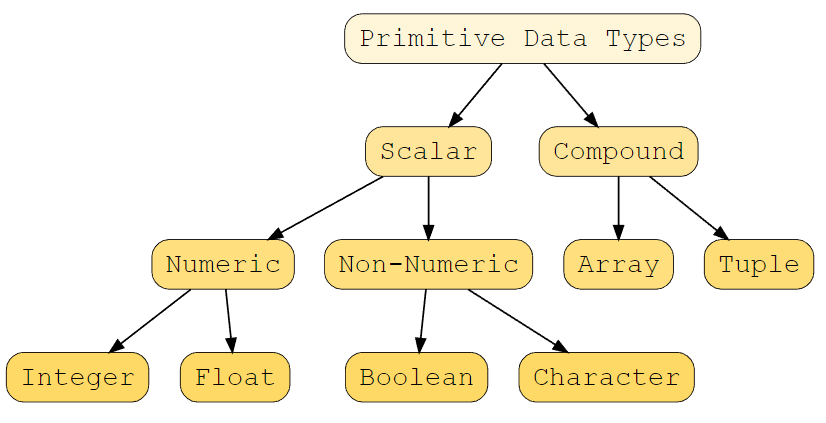

## Data Types

Rust is a **statically typed** language so we need to specify the data type at compile time.

We can define the variable like:

```rust
let variable name = value;
```

So we don't really specify the datatype. The compiler know what the datatype will be.

```rust
let variable name:datatype = value;
```

In Rust we have some *primitive* datatype.



### Numeric Types

#### Integer

So when we want to specify the datatype, we need to either choose a *signed* or *unsigned*. So signed is an integer that can be positive or negative. Then we specify the amount of bits with `8`, `16`, `32` or `64`.

```rust
fn main() {
    //explicitly define an integer
    let a:i32 = 24;
}
```

#### Floating Point 

We have also float (so number like `3.141`). We can specify it with `f` and then we can choose between `32` or `64`.