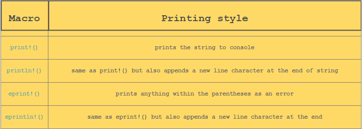

## Getting Started

### The Basic Program

We wrote a little program ([here](hello-rust/src/main.rs))

```rust
fn main() {
    println!("Hello World!");
}
```

First we instantiate the main function that is actually gonna run `fn main()`.

We print everything with `println!()`. Like in C we need to end with a semi-colon.

We also define a code block like in C with `{}`.

We see we added `!` before `println` which is a **macro**. Macro is used in *metaprogramming*. In other words, it is code that writes code. It is not a function that call like functions. They are expanded and provide more run-time features. (more info [here](https://doc.rust-lang.org/book/ch19-06-macros.html))

### Basic Formatting

We can use a placeholder like in python:
```rust
println!("{}", 1)
```

We can use formatting to print variables value. We can also use multiple placeholders like:

```rust
fn main(){
    println!("Hello my name is {} and I am {}", "John", "20" );
}
```

We can also use *positional* arguments which is just indicating what goes where with `{0}` or `{1}` etc.

We can also *name an argument* like this:

```rust
fn main() {
    println!("My name is  {name} and I do {job}", name="John", job="Science");
}
```

We can also format data to have a certain way to display.

```{:b},{:x},{:o}```
 
 b is for binary, x is for hexadecimal then o is octal.

 We can also compute inside of those brackets.

 We can also use the bracket as a debug thanks to the `{:?}` and it helps us printing multiple value like:

 ```rust
 fn main() {
    println!("{:?}", ("This is a Rust Course", 101));
}
```

## Printing Styles

We have different type of printing:


## Comments

We have different types of comment:
1. Line comments: `//`
2. Block comments: `/*...*/`
3. Doc comments: `///` and `//!`
   1. Outer doc comments: `///` They are written outside of the code block (it supports markdown notation)
   2. Inner doc comments: `//!` So we add the comment inside of a code block.