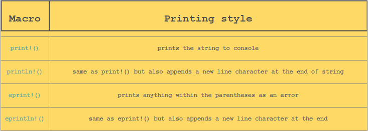
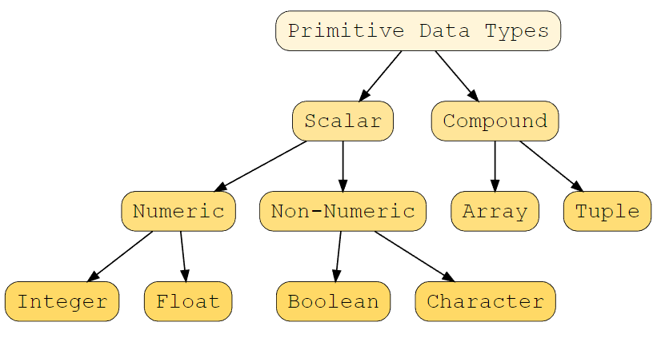
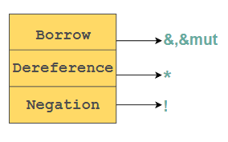
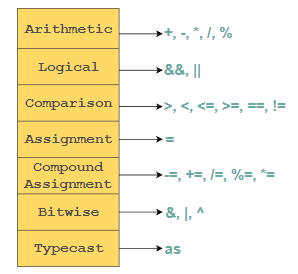
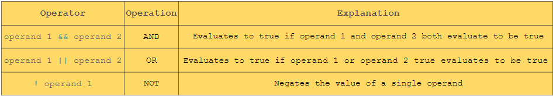
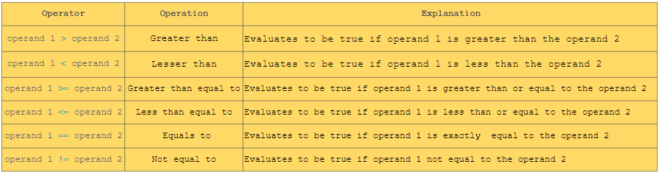
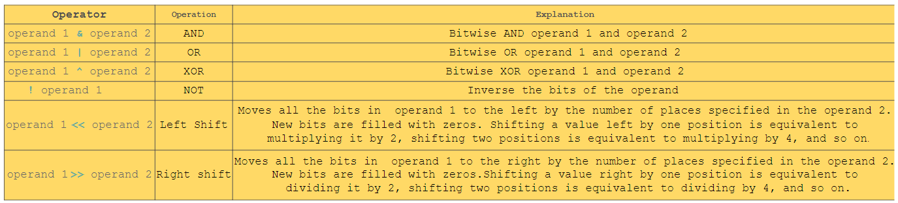

# Learn Rust from Scratch

<details>
<summary> Summary</summary>
<br>


- [Learn Rust from Scratch](#learn-rust-from-scratch)
  - [Getting Started](#getting-started)
    - [The Basic Program](#the-basic-program)
    - [Basic Formatting](#basic-formatting)
  - [Printing Styles](#printing-styles)
  - [Comments](#comments)
  - [Variables](#variables)
    - [Scope and Shadowing](#scope-and-shadowing)
  - [Data Types](#data-types)
    - [Numeric Types](#numeric-types)
    - [Boolean](#boolean)
    - [Character and String](#character-and-string)
    - [Arrays](#arrays)
    - [Tuples](#tuples)
    - [Constant Variables](#constant-variables)
  - [Operators](#operators)
    - [Arithmetic](#arithmetic)
    - [Logical](#logical)
    - [Comparison](#comparison)
    - [Bitwise](#bitwise)
    - [Type Casting Operator](#type-casting-operator)
    - [Borrowing and Dereferencing Operators](#borrowing-and-dereferencing-operators)
  - [Conditional Expressions](#conditional-expressions)
    - [If](#if)
    - [If Let](#if-let)
    - [Match](#match)
  - [Loops](#loops)
    - [Definite Loop](#definite-loop)
    - [Indefinite Loops](#indefinite-loops)
    - [Break Statement](#break-statement)
    - [Continue Statement](#continue-statement)
    - [Loop Labels](#loop-labels)
  - [Functions](#functions)
    - [Functions with Parameters](#functions-with-parameters)
    - [Pass by Value](#pass-by-value)
    - [Pass by Reference](#pass-by-reference)
    - [Returning a Value From a Function](#returning-a-value-from-a-function)
    - [Returning Multiple Values](#returning-multiple-values)
    - [Function with Arrays as Arguments](#function-with-arrays-as-arguments)
  - [Strings](#strings)
    - [Core methods of String Objects](#core-methods-of-string-objects)
    - [Iterating over Strings](#iterating-over-strings)
    - [Updating a String](#updating-a-string)
    - [Slicing a string](#slicing-a-string)
    - [Functions and Strings](#functions-and-strings)
  - [Vectors](#vectors)
  - [Structs](#structs)
  - [Enums](#enums)
  - [Traits and Generics](#traits-and-generics)
  - [Modules](#modules)
  - [Lifetime and Memory Management](#lifetime-and-memory-management)


</details>

## Getting Started

### The Basic Program

We wrote a little program ([here](hello-rust/src/main.rs))

```rust
fn main() {
    println!("Hello World!");
}
```

First we instantiate the main function that is actually gonna run `fn main()`.

We print everything with `println!()`. Like in C we need to end with a semi-colon.

We also define a code block like in C with `{}`.

We see we added `!` before `println` which is a **macro**. Macro is used in *metaprogramming*. In other words, it is code that writes code. It is not a function that call like functions. They are expanded and provide more run-time features. (more info [here](https://doc.rust-lang.org/book/ch19-06-macros.html))

### Basic Formatting

We can use a placeholder like in python:
```rust
println!("{}", 1)
```

We can use formatting to print variables value. We can also use multiple placeholders like:

```rust
fn main(){
    println!("Hello my name is {} and I am {}", "John", "20" );
}
```

We can also use *positional* arguments which is just indicating what goes where with `{0}` or `{1}` etc.

We can also *name an argument* like this:

```rust
fn main() {
    println!("My name is  {name} and I do {job}", name="John", job="Science");
}
```

We can also format data to have a certain way to display.

```{:b},{:x},{:o}```
 
 b is for binary, x is for hexadecimal then o is octal.

 We can also compute inside of those brackets.

 We can also use the bracket as a debug thanks to the `{:?}` and it helps us printing multiple value like:

 ```rust
 fn main() {
    println!("{:?}", ("This is a Rust Course", 101));
}
```

## Printing Styles

We have different type of printing:


## Comments

We have different types of comment:
1. Line comments: `//`
2. Block comments: `/*...*/`
3. Doc comments: `///` and `//!`
   1. Outer doc comments: `///` They are written outside of the code block (it supports markdown notation)
   2. Inner doc comments: `//!` So we add the comment inside of a code block.

## Variables

- [Variables](#variables)
  - [Scope and Shadowing](#scope-and-shadowing)


A variable is like a box. We store data inside a variable and the variable has a name. The name of a variable is called *identifier*. By default they are all **immutable**.

```rust
let language ;
```

We just instantiate a variable.

```rust
let language = "Rust";
```

We just created a variable and assigned a string to it.

#### Mutable Variable

To make a variable mutable we just need to add the identifier `mut`:

```rust
let mut language = "Rust";
```

We can use tuple like to assign multiple variable:

```rust
let (course,category) = ("Rust","beginner");
```

### Scope and Shadowing

FOr the scope it's like in C where it depends of the codeblock. We can redeclare a variable outside and the scope of the variable will change. We call this **shadowing**. So when a variable that takes the same name in the inner block as that of variable in the outer block.


## Data Types

Rust is a **statically typed** language so we need to specify the data type at compile time.

We can define the variable like:

```rust
let variable name = value;
```

So we don't really specify the datatype. The compiler know what the datatype will be.

```rust
let variable name:datatype = value;
```

In Rust we have some *primitive* datatype.



### Numeric Types

#### Integer

So when we want to specify the datatype, we need to either choose a *signed* or *unsigned*. So signed is an integer that can be positive or negative. Then we specify the amount of bits with `8`, `16`, `32` or `64`.

```rust
fn main() {
    //explicitly define an integer
    let a:i32 = 24;
}
```

#### Floating Point 

We have also float (so number like `3.141`). We can specify it with `f` and then we can choose between `32` or `64`.

### Boolean

It is either a `true` or `false`. This datatype `bool`.

### Character and String

Character is just one character as it says. We need to use single quote. So something `let my_char = 'a'`. The datatype is `char`.

#### String

A string is multiple character defined with a *double quote*. `let program = "Rust"`. We use `&str` for the datatype. (if you know C prior you know why there is a `&`).

### Arrays

Do define an array we need to do `let name: [type; size] = [elem1, elem2, elem3];`. So we need to specify what we put in the array and what is the fixed amount in the array. We can also instantiate an array with the same data with a certain amount.

```rust
fn main() {
   //define an array of size 4
   let arr:[i32;4] = [1, 2, 3, 4]; 
   // initialize an array of size 4 with 0
   let arr1 = [0 ; 4]; 
   print!("{:?}", arr1);
}
```

We can make an array mutable by adding the keyword `mut` to change the values.

To print the whole array we need to print with the debug option `{:?}`.

We can get the length of the array with `arr1.len()`. 

#### Slice

We can slice array with `let slice_array2:&[i32] = &arr[0..2];`.

### Tuples

There is two way to write a tuple:

#### 1. 

We can do tuple with multiple datatype.

```rust
let tupleName = ("Rust", 'a', 1);
```

#### 2.

We can specify the datatype of each element in the tuple.

```rust
let tupleName:(&str, char, i32) = ("Rust", 'a', 1);
```

To access to data we need to do something like `tupleName.0`.

As with array, we can print it with debug and add `mut` to make it mutable.

### Constant Variables

We can set a variable constant with `const` keyword.

The difference between `const` and `let`. We can declare the constant variable as *global* with `const` we cannot do this with `let`.

We must define the datatype for a constant. We also need the `const` to be set before running so we cannot store the result at runtime:

```rust
let a = *a random variable*; // ✔
const b = *a random variable*; // ✖
```

We cannot do shadowing with constant.

## Operators

- [Learn Rust from Scratch](#learn-rust-from-scratch)
  - [Getting Started](#getting-started)
    - [The Basic Program](#the-basic-program)
    - [Basic Formatting](#basic-formatting)
  - [Printing Styles](#printing-styles)
  - [Comments](#comments)
  - [Variables](#variables)
    - [Scope and Shadowing](#scope-and-shadowing)
  - [Data Types](#data-types)
    - [Numeric Types](#numeric-types)
    - [Boolean](#boolean)
    - [Character and String](#character-and-string)
    - [Arrays](#arrays)
    - [Tuples](#tuples)
    - [Constant Variables](#constant-variables)
  - [Operators](#operators)
    - [Arithmetic](#arithmetic)
    - [Logical](#logical)
    - [Comparison](#comparison)
    - [Bitwise](#bitwise)
    - [Type Casting Operator](#type-casting-operator)
    - [Borrowing and Dereferencing Operators](#borrowing-and-dereferencing-operators)
  - [Conditional Expressions](#conditional-expressions)
    - [If](#if)
    - [If Let](#if-let)
    - [Match](#match)
  - [Loops](#loops)
    - [Definite Loop](#definite-loop)
    - [Indefinite Loops](#indefinite-loops)
    - [Break Statement](#break-statement)
    - [Continue Statement](#continue-statement)
    - [Loop Labels](#loop-labels)
  - [Functions](#functions)
    - [Functions with Parameters](#functions-with-parameters)
    - [Pass by Value](#pass-by-value)
    - [Pass by Reference](#pass-by-reference)
    - [Returning a Value From a Function](#returning-a-value-from-a-function)
    - [Returning Multiple Values](#returning-multiple-values)
    - [Function with Arrays as Arguments](#function-with-arrays-as-arguments)
  - [Strings](#strings)
    - [Core methods of String Objects](#core-methods-of-string-objects)
    - [Iterating over Strings](#iterating-over-strings)
    - [Updating a String](#updating-a-string)
    - [Slicing a string](#slicing-a-string)
    - [Functions and Strings](#functions-and-strings)
  - [Vectors](#vectors)
  - [Structs](#structs)
  - [Enums](#enums)
  - [Traits and Generics](#traits-and-generics)
  - [Modules](#modules)
  - [Lifetime and Memory Management](#lifetime-and-memory-management)




### Arithmetic


### Logical



### Comparison



### Bitwise



### Type Casting Operator

When we want to convert some datatype into another we need to call the `as` keyword like so:

```rust
let a:i32 = 10;
let b = (a as f32)/2.0;
```

### Borrowing and Dereferencing Operators

References are just like *pointer* in C. For example we can save where something points:

```rust
let operand1 = & operand2
let operand3 = &mut operand2
```

The first is a *shared* borrow. So we can read data of ``operand2``. The second is **mutable** so we can read and modify data.


```rust
fn main() {
    let x = 10;
    let mut y = 13;
    //immutable reference to a variable
    let a = &x;
    println!("Value of a:{}", a); 
    println!("Value of x:{}", x); // x value remains the same since it is immutably borrowed
    //mutable reference to a variable
    let b = &mut y;
    println!("Value of b:{}", b);

    *b = 11; // derefencing 
    println!("Value of b:{}", b); // updated value of b
    println!("Value of y:{}", y); // y value can be changed as it is mutuably borrowed
}
```

Output:
```
Value of a:10
Value of x:10
Value of b:13
Value of b:11
Value of y:11
```

To modify the value inside of a pointer we need to like in C so we use a `*`.

## Conditional Expressions 

In Rust we have 3 types of conditional expressions:

1. `if`
2. `if let`
3. `match`

### If

It's simply `if condition` and then a codeblock. We can also have `else`.


The short version of this is something like:

```rust
let x = if(condition) { statement } else { statement };
```

### If Let

It is a conditional with some *pattern matching*.

```rust
if let(value 1, value 2) = match_expression{
    // Do something
}
```

We can also let Rust guess the last value like this:

```rust
fn main() {
    // define a scrutinee expression    
    let course = ("Rust", "beginner","course");
    // pattern matches with the scrutinee expression
    if let ("Rust", "beginner", c) = course {
        println!("Wrote first two values in pattern to be matched with the scrutinee expression : {}", c);
    } 
    else {
        // do not execute this block
        println!("Value unmatched");
    }
}
```

### Match 

It lets us check if a value is part of a list of value.

```rust
fn main() {
    // define a variable 
    let x = 5;
    // define match expression
    match x {
        1 => println!("Java"),
        2 => println!("Python"),
        3 => println!("C++"),
        4 => println!("C#"),
        5 => println!("Rust"),
        6 => println!("Kotlin"),
        _ => println!("Some other value"),
    };
}
```

So thanks to this match function we can easily set the value of a variable depending of another value. like this:

```rust
fn main(){
   // define a variable
   let course = "Rust";
   // return value of match expression in a variable
   let found_course = match course {
      "Rust" => "Rust",
      "Java" => "Java",
      "C++" => "C Plus Plus",
      "C#" => "C Sharp",
      _ => "Unknown Language"
   };
   println!("Course name : {}",found_course);
}
```

## Loops

We have either:
1. Definite loops with `for`.
2. Indefinite loops with `while` and `loop`.

### Definite Loop

The syntax of a ``for`` in Rust is like the following:

```rust
for i in 0..10{
  println!("{}", i)
}
```

So it will enumerate from 0 up until 10 non inclusive.

We can also **enumerate** on the iteration like this

```rust
for (count, variable) in (7..10).enumerate() {
  println!("count = {}, variable = {}", count, variable);
}
```

<details>
<summary>Output</summary>
<br>

```
count = 0, variable = 7
count = 1, variable = 8
count = 2, variable = 9
```
</details>

### Indefinite Loops

#### While

It's like any `while` loop ever.

```rust
while i < 0{
  // Do something
  i+=1;
}
```

#### Loop

We can make the iteration continue *infinitely* with a `loop`.

```rust
loop{
  // Do something
}
```

### Break Statement

It is to simply break from a loop.

```rust
for i in 0..10 {
  if i==1 {
    break;
  }
}
```

### Continue Statement

It is the opposite of the `break` statement. A `continue` will just keep the loop to run.

### Loop Labels

Something specific to Rust, it is the label to a loop. We had a lap before a `for`, `while` or `loop` with a `:`.

```rust
fn main() {
 'outer:for i in 1..5 { //outer loop
    println!("Multiplication Table : {}", i);
   'inner:for j in 1..5 { // inner loop
        if i == 3 { continue 'outer; } // Continues the loop over `i`.
        if j == 2 { continue 'inner; } // Continues the loop over `j`.
        println!("{} * {} = {}", i, j, i * j);
   }
 }
}
```

<details>
<summary>Output</summary>
<br>

```
Multiplication Table : 1
1 * 1 = 1
1 * 3 = 3
1 * 4 = 4
Multiplication Table : 2
2 * 1 = 2
2 * 3 = 6
2 * 4 = 8
Multiplication Table : 3
Multiplication Table : 4
4 * 1 = 4
4 * 3 = 12
4 * 4 = 16
```
</details>


## Functions

```rust
//define a function
fn display_message(){
  println!("Hi, this is my user defined function");
}
//driver function
fn main() {
     //invoke a function
      display_message();
      println!("Function ended");
}
```

<details>
<summary>Output</summary>
<br>

```
Hi, this is my user defined function
Function ended
```
</details>

### Functions with Parameters

When we have a function in Rust, we not only need to specify the name of the parameter but its type with something looking like `param_1:i32`.

```rust
//function definition
fn my_func(param_1:i32, param_2:i32) {
  println!("The first value passed inside function : {}", param_1);
  println!("The second value passed inside function : {}", param_2);
}
fn main() {
  let value_1 = 1;
  let value_2 = 2;
  //calling the function
  my_func( value_1, value_2 );
  println!("Function ended");
}
```

### Pass by Value

It is important to know that the value passed like this are a **copy** of the value ! So it won't change the actual variable. To change the variable we need to pass its reference (more [here](#pass-by-reference)).


### Pass by Reference

If we want to change the value passed, we need to use the reference of this variable with this `param_1:&mut i32`.

```rust
fn square(n:&mut i32){
  *n = *n * *n;
  println!("The value of n inside function : {}", n);
}  
fn main() {
  let  mut n = 4;
  println!("The value of n before function call : {}", n);
  println!("Invoke Function");
  square(&mut n);
  println!("The value of n after function call : {}", n);
}
```

<details>
<summary>Output</summary>
<br>

```
The value of n before function call : 4
Invoke Function
The value of n inside function : 16
The value of n after function call : 16
```
</details>

### Returning a Value From a Function

Before using the keyword `return` to return our value, we need to specify what type of value is returned by our function with something like this `fn functionName(param1:datatype) -> datatype`. And then we need to use `return value`.

```rust
fn square(n:i32)->i32{
  println!("The value of n inside function : {}", n);
  let m = n * n;
  m // return the square of the number n
}  
fn main() {
  let  n = 4;
  println!("The value of n before function call : {}", n);
  println!("Invoke Function");
  println!("\nOutput : {}",square(n));
}
```

<details>
<summary>Output</summary>
<br>

```
The value of n before function call : 4
Invoke Function
The value of n inside function : 4

Output : 16
```
</details>

### Returning Multiple Values

To return multiple value we can do this by using a tuple.

```rust
// driver function
fn main() {
    let length = 4;
    let width = 3;
    println!("Rectangle length:{}", length);
    println!("Rectangle width:{}", width);
    let (area, perimeter) = calculate_area_perimeter(length, width);
    println!("Area: {}, Perimeter: {}", area, perimeter);
}
// calculate area and perimeter
fn calculate_area_perimeter(x: i32, y: i32) -> (i32, i32) {
    // calculate the area and perimeter of rectangle
    let area = x * y;
    let perimeter = 2 * (x + y);
    // return the area and perimeter of rectangle
    (area, perimeter)
}
```

### Function with Arrays as Arguments

If we pass an array as argument, we need to use this syntax:

```rust
fn function_name( mut array_name:[datatype;size] )
```

#### Pass by Reference

We can also pass by *reference* by simply adding `&`.

```rust
fn function_name( mut array_name:[&datatype;size] )
```

#### Return an Array

To return an array we do:

```rust
fn function_name() ->[datatype;size] 
```

## Strings

#### String Literal `&str`

String are like in C, defined with a pointer, fixed size and we **must** know its length at *compile time*. It is primitive.

#### String Object `String`

It is encoded in *UTF-8* and it's allocated in the Heap. We can modify its size, not null-terminated.

To create a new String object, we can either convert a string literal or create a brand new one.

```rust
let language = String::new();
let S_language = language.to_string();
```

So here we create a new empty string literal and then we convert it.

```rust
let language = String::from("Rust");
```

We can use the `len()` to get the length of a string object.

### Core methods of String Objects

We have the amount of bytes allocated to a string object with the `capacity()` function:

```rust
fn main() {
  // define a growable string variable
  let course = String::from("Rust");
  println!("This is a beginner course in {}.", course);
  //capacity in bytes
  println!("Capacity: {}.", course.capacity());
}
```

<details>
<summary>Output</summary>
<br>

```
This is a beginner course in Rust.
Capacity: 4.
```
</details>

We can see if a substring is in a string (for example is low in the word below) with the function `contains`.

We can replace a specific substring of a string thanks to the `replace`. If we have a string `str` that contains a substring `bad` and we want to change it for something else `good` we do `str.replace(bad, good)`.

To remove some unwanted blank space at the beginning and end of a string we do `trim()`.

### Iterating over Strings

We can *tokenize* a string with `split_whitespace()` so we can iterate on word of a string.

We can also tokenize on a specific character thanks to `split(str_split)`. With ``str_split`` being where we split. 

We can also simply iterate over the character of a string object with `chars()`.

### Updating a String

To add a character at the end of a string, we need to use `push()`. If we want want to add a whole new substring at the end, we need to use `push_str()` .

We also can concatenate two strings like this:

```rust
#[allow(unused_variables, unused_mut)]
fn main(){
   // define a String object 
   let course = "Rust".to_string();
   // define a String object
   let course_type = " beginner course".to_string();
   // concatenate using the + operator
   let result = course + &course_type;
   println!("{}", result);
}
```

For this task, we can also use the macro `format!` which is really convenient:

```rust
fn main(){
  
   let course = "Rust".to_string();
   let _course_type = "beginner course".to_string();
   // default format macro 
   let result = format!("{} {}", course, _course_type);
   // passing value in the placeholder in the format macro 
   let result = format!("{1} {0}", course,_course_type);
   println!("{}", result);
}
```

<details>
<summary>Output</summary>
<br>

```
beginner course Rust
```
</details>

### Slicing a string

To slice a string we just do this:

```rust
let slice = &string[start..end];
```

### Functions and Strings

To pass a string literal to a function, we use `&str` and for a string object, we use `String`.

## Vectors


## Structs

## Enums

## Traits and Generics

## Modules

## Lifetime and Memory Management


