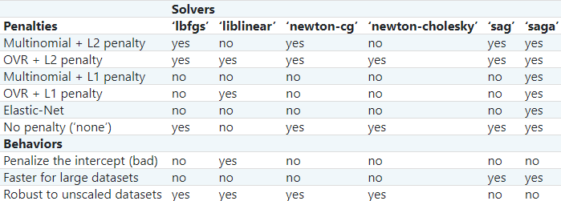

[↰](../note.md)
## Data Modeling with scikit-learn

- [Data Modeling with scikit-learn](#data-modeling-with-scikit-learn)
  - [Linear Regression](#linear-regression)
  - [Ridge Regression](#ridge-regression)
  - [LASSO Regression](#lasso-regression)
  - [Bayesian Regression](#bayesian-regression)
  - [Logistic Regression](#logistic-regression)
  - [Decision Trees](#decision-trees)
  - [Training and Testing](#training-and-testing)
  - [Cross-Validation](#cross-validation)
  - [Applying CV to Decision Trees](#applying-cv-to-decision-trees)
  - [Evaluating Models](#evaluating-models)
  - [Exhaustive Tuning](#exhaustive-tuning)

Sometimes, we want to create model for our data. Showing relationship and a sort of predictability. That's why we use models for linear regression. Now we need to get the *hyperparameters* to find the constants and variables.

### Linear Regression

It's the simplest model that use an equation looking like:

$$y = ax_1 + bx_2 + cx_3 + ... + d $$
So the goal here is to find the best coefficient that matches as close as possible our data.

The simplest way to find the coefficients is by using the **least squares regression**. In short, we sum the squared residuals between the actual data and the prediction.

To use in scikit-learn, we use the `LinearRegression` object which is part of `linear_model` module in `sklearn`. To fit the the function according to our data, we use the `fit` function.

```python
# predefined pizza data and prices

from sklearn import linear_model
reg = linear_model.LinearRegression()
reg.fit(pizza_data, pizza_prices)
```
<details>
<summary>Output</summary>
<br>

```
array([[2100,  800],
       [2500,  850],
       [1800,  760],
       [2000,  800],
       [2300,  810]])

array([10.99, 12.5 ,  9.99, 10.99, 11.99])
```
</details>

Once we used the `fit` funciton, we can use our linear regression by calling the `predict` function. We can pass an array of array and we can get the coefficient with `coef_` and to get the intercept we use `intercept_`.

To know how good a model is we can use the **coefficient of determination** ($R^2$ value) with the function `score`.

```python
# new pizza data
new_pizzas = np.array([[2000,  820],
                       [2200,  830]])

price_predicts = reg.predict(new_pizzas)
print('{}\n'.format(repr(price_predicts)))

print('Coefficients: {}\n'.format(repr(reg.coef_)))
print('Intercept: {}\n'.format(reg.intercept_))

# Using previously defined pizza_data, pizza_prices
r2 = reg.score(pizza_data, pizza_prices)
print('R2: {}\n'.format(r2))
```
<details>
<summary>Output</summary>
<br>

```
array([10.86599206, 11.55111111])

Coefficients: array([0.00330913, 0.00232937])

Intercept: 2.3376587301587346

R2: 0.9758349388652625
```
</details>

Something to note is that $R^2$ ranges usually from $0$ to $1$ but in scikit, it ranges from $-\infty$ to $1$.

### Ridge Regression

For Linear regression to work, we must have **uncorrelated data** or it won't work out. The least squares regression model is *highly* sensitive to noise in the data. We need to perform a *regularization*. Usually for least square we do this: 

$$\sum_{i=1}^n (x_i \cdot w - y_i)^2$$

Where we want to find the coefficient that minimizes the sum.

Now we want to do the same but with coefficient **as small as possible**. A smaller coefficient is less susceptible to noise. We use the **ridge regularization**;

$$\alpha ||w||_2^2 + \sum_{i=1}^n (x_i \cdot w - y_i)^2$$

$\alpha$ is a non-negative real number and $||w||_2$ represents the L2 norm of the weights.

#### Choosing the best $\alpha$

We need to use the `Ridge` object to use the ridge regression.
```python
from sklearn import linear_model
reg = linear_model.Ridge(alpha=0.1)
reg.fit(pizza_data, pizza_prices)
print('Coefficients: {}\n'.format(repr(reg.coef_)))
print('Intercept: {}\n'.format(reg.intercept_))
r2 = reg.score(pizza_data, pizza_prices)
print('R2: {}\n'.format(r2))
```

<details>
<summary>Output</summary>
<br>

```
Coefficients: array([0.00330919, 0.0023288 ])

Intercept: 2.337978289647138

R2: 0.9758349388362842
```
</details>

We can specify $\alpha$ when initializing the `Ridge` object. We will rather use **cross-validation** to choose the best $\alpha$. (see the [chapter](#cross-validation) about cross-validation). For now we can simply use the `RidgeCV` object:

```python
from sklearn import linear_model
alphas = [0.1, 0.2, 0.3]
reg = linear_model.RidgeCV(alphas=alphas)
reg.fit(pizza_data, pizza_prices)
print('Coefficients: {}\n'.format(repr(reg.coef_)))
print('Intercept: {}\n'.format(reg.intercept_))
print('Chosen alpha: {}\n'.format(reg.alpha_))
```
<details>
<summary>Output</summary>
<br>

```
Coefficients: array([0.00330932, 0.00232767])

Intercept: 2.338616853432976

Chosen alpha: 0.3
```
</details>

### LASSO Regression

Here, we use a L1 norm for the wieghts penalty.

$$\alpha ||w||_1 + \sum_{i=1}^n (x_i \cdot w - y_i)^2$$
Lasso regularization works best with fewer parameter values. So it may zero-out some weights. It is dependant on less variable. To implement it in scikit we call the `Lasso` object. We can also set our alpha.

```python
# predefined dataset
print('Data shape: {}\n'.format(data.shape))
print('Labels shape: {}\n'.format(labels.shape))

from sklearn import linear_model
reg = linear_model.Lasso(alpha=0.1)
reg.fit(data, labels)
print('Coefficients: {}\n'.format(repr(reg.coef_)))
print('Intercept: {}\n'.format(reg.intercept_))
print('R2: {}\n'.format(reg.score(data, labels)))
```

<details>
<summary>Output</summary>
<br>

```
Data shape: (150, 4)

Labels shape: (150,)

Coefficients: array([ 0.        , -0.        ,  0.40811896,  0.        ])

Intercept: -0.5337110569441175

R2: 0.8958211202747038
```
</details>

We see that some got transformed into 0. Also, we can use the `LassoCV` object to do cross-validation.


### Bayesian Regression

Besides using CV to optimize the parameters, we can use **Bayesian** techniques. The goal here is to make an assumption about the probability distributions. We call this a prior for the model. In a Bayesian ridge, we have 2 parameters to optimize: $\lambda$ and $\alpha$. The $\lambda$ acts for the precision. The smaller it gets the better is the variance between individual weight values.

Both of those parameters have a **gamma distribution**. So we have
$$\Gamma (\alpha_1 , \alpha_2) \quad \Gamma (\lambda , \lambda_2)$$

We not only fine tune the parameters but also the $\alpha$ and $\lambda$ via the `BayesianRidge` object:
```python
# predefined dataset from previous chapter
print('Data shape: {}\n'.format(data.shape))
print('Labels shape: {}\n'.format(labels.shape))

from sklearn import linear_model
reg = linear_model.BayesianRidge()
reg.fit(data, labels)
print('Coefficients: {}\n'.format(repr(reg.coef_)))
print('Intercept: {}\n'.format(reg.intercept_))
print('R2: {}\n'.format(reg.score(data, labels)))
print('Alpha: {}\n'.format(reg.alpha_))
print('Lambda: {}\n'.format(reg.lambda_))
```
<details>
<summary>Output</summary>
<br>

```
Data shape: (150, 4)

Labels shape: (150,)

Coefficients: array([-0.11362625, -0.03526763,  0.24468776,  0.57300547])

Intercept: 0.16501980374056868

R2: 0.9303174820768508
```
</details>

We can specify the $\alpha_1$ and $\alpha_2$ by passing `alpha_1` or `alpha_2`. Same for $\lambda$, the default is $10^{-6}$.

### Logistic Regression

It is a linear model for **classification**. We perform regression on *logits* ($f(x) = ln(\frac{x}{1-x})$). To implement it, we use the `LogisticRegression` object. By default, the regression is binary.

```python
# predefined dataset
print('Data shape: {}\n'.format(data.shape))
# Binary labels
print('Labels:\n{}\n'.format(repr(labels)))

from sklearn import linear_model
reg = linear_model.LogisticRegression()
reg.fit(data, labels)

new_data = np.array([
  [  0.3,  0.5, -1.2,  1.4],
  [ -1.3,  1.8, -0.6, -8.2]])
print('Prediction classes: {}\n'.format(
  repr(reg.predict(new_data))))
```

<details>
<summary>Output</summary>
<br>

```
Data shape: (569, 4)

Labels:
array([0, 0, 0, 0, 0, 0, 0, 0, 0, 0, 0, 0, 0, 0, 0, 0, 0, 0, 0, 1, 1, 1,
       0, 0, 0, 0, 0, 0, 0, 0, 0, 0, 0, 0, 0, 0, 0, 1, 0, 0, 0, 0, 0, 0,
       0, 0, 1, 0, 1, 1, 1, 1, 1, 0, 0, 1, 0, 0, 1, 1, 1, 1, 0, 1, 0, 0,
       1, 1, 1, 1, 0, 1, 0, 0, 1, 0, 1, 0, 0, 1, 1, 1, 0, 0, 1, 0, 0, 0,
       1, 1, 1, 0, 1, 1, 0, 0, 1, 1, 1, 0, 0, 1, 1, 1, 1, 0, 1, 1, 0, 1,
       1, 1, 1, 1, 1, 1, 1, 0, 0, 0, 1, 0, 0, 1, 1, 1, 0, 0, 1, 0, 1, 0,
       0, 1, 0, 0, 1, 1, 0, 1, 1, 0, 1, 1, 1, 1, 0, 1, 1, 1, 1, 1, 1, 1,
       1, 1, 0, 1, 1, 1, 1, 0, 0, 1, 0, 1, 1, 0, 0, 1, 1, 0, 0, 1, 1, 1,
       1, 0, 1, 1, 0, 0, 0, 1, 0, 1, 0, 1, 1, 1, 0, 1, 1, 0, 0, 1, 0, 0,
       0, 0, 1, 0, 0, 0, 1, 0, 1, 0, 1, 1, 0, 1, 0, 0, 0, 0, 1, 1, 0, 0,
       1, 1, 1, 0, 1, 1, 1, 1, 1, 0, 0, 1, 1, 0, 1, 1, 0, 0, 1, 0, 1, 1,
       1, 1, 0, 1, 1, 1, 1, 1, 0, 1, 0, 0, 0, 0, 0, 0, 0, 0, 0, 0, 0, 0,
       0, 0, 1, 1, 1, 1, 1, 1, 0, 1, 0, 1, 1, 0, 1, 1, 0, 1, 0, 0, 1, 1,
       1, 1, 1, 1, 1, 1, 1, 1, 1, 1, 1, 0, 1, 1, 0, 1, 0, 1, 1, 1, 1, 1,
       1, 1, 1, 1, 1, 1, 1, 1, 1, 0, 1, 1, 1, 0, 1, 0, 1, 1, 1, 1, 0, 0,
       0, 1, 1, 1, 1, 0, 1, 0, 1, 0, 1, 1, 1, 0, 1, 1, 1, 1, 1, 1, 1, 0,
       0, 0, 1, 1, 1, 1, 1, 1, 1, 1, 1, 1, 1, 0, 0, 1, 0, 0, 0, 1, 0, 0,
       1, 1, 1, 1, 1, 0, 1, 1, 1, 1, 1, 0, 1, 1, 1, 0, 1, 1, 0, 0, 1, 1,
       1, 1, 1, 1, 0, 1, 1, 1, 1, 1, 1, 1, 0, 1, 1, 1, 1, 1, 0, 1, 1, 0,
       1, 1, 1, 1, 1, 1, 1, 1, 1, 1, 1, 1, 0, 1, 0, 0, 1, 0, 1, 1, 1, 1,
       1, 0, 1, 1, 0, 1, 0, 1, 1, 0, 1, 0, 1, 1, 1, 1, 1, 1, 1, 1, 0, 0,
       1, 1, 1, 1, 1, 1, 0, 1, 1, 1, 1, 1, 1, 1, 1, 1, 1, 0, 1, 1, 1, 1,
       1, 1, 1, 0, 1, 0, 1, 1, 0, 1, 1, 1, 1, 1, 0, 0, 1, 0, 1, 0, 1, 1,
       1, 1, 1, 0, 1, 1, 0, 1, 0, 1, 0, 0, 1, 1, 1, 0, 1, 1, 1, 1, 1, 1,
       1, 1, 1, 1, 1, 0, 1, 0, 0, 1, 1, 1, 1, 1, 1, 1, 1, 1, 1, 1, 1, 1,
       1, 1, 1, 1, 1, 1, 1, 1, 1, 1, 1, 1, 0, 0, 0, 0, 0, 0, 1])

Prediction classes: array([1, 0])
```
</details>

We can also do *multiclass classification* (so when there is more than 2 labels). We need to initalize the `LogisticRegresssion` object with the keyword `multi_class`. By default, we are on `ovr` (One Vs Rest) here we want to use the `multinomial` strategy.

```python
# predefined dataset
print('Data shape: {}\n'.format(data.shape))
# Multiclass labels
print('Labels:\n{}\n'.format(repr(labels)))

from sklearn import linear_model
reg = linear_model.LogisticRegression(
  solver='lbfgs',
  multi_class='multinomial', max_iter=200)
reg.fit(data, labels)

new_data = np.array([
  [ 1.8, -0.5, 6.2, 1.4],
  [ 3.3,  0.8, 0.1, 2.5]])
print('Prediction classes: {}\n'.format(
  repr(reg.predict(new_data))))
```

<details>
<summary>Output</summary>
<br>

```
Data shape: (150, 4)

Labels:
array([0, 0, 0, 0, 0, 0, 0, 0, 0, 0, 0, 0, 0, 0, 0, 0, 0, 0, 0, 0, 0, 0,
       0, 0, 0, 0, 0, 0, 0, 0, 0, 0, 0, 0, 0, 0, 0, 0, 0, 0, 0, 0, 0, 0,
       0, 0, 0, 0, 0, 0, 1, 1, 1, 1, 1, 1, 1, 1, 1, 1, 1, 1, 1, 1, 1, 1,
       1, 1, 1, 1, 1, 1, 1, 1, 1, 1, 1, 1, 1, 1, 1, 1, 1, 1, 1, 1, 1, 1,
       1, 1, 1, 1, 1, 1, 1, 1, 1, 1, 1, 1, 2, 2, 2, 2, 2, 2, 2, 2, 2, 2,
       2, 2, 2, 2, 2, 2, 2, 2, 2, 2, 2, 2, 2, 2, 2, 2, 2, 2, 2, 2, 2, 2,
       2, 2, 2, 2, 2, 2, 2, 2, 2, 2, 2, 2, 2, 2, 2, 2, 2, 2])

Prediction classes: array([2, 0])
```
</details>

We can see here that we had to use a *solver*. Thanks to a solver we can get the weights:



By defaults, the logistic regression is regularized by the L2 norm of weights.

#### Cross-validated

We can use a cross-validated version thanks to `LogisticRegressionCV` like this:

```python
from sklearn import linear_model
reg = linear_model.LogisticRegressionCV(
  solver='multinomial', max_iter=1000)
```

### Decision Trees

We can use a binary tree to make a decision and classify everything. In scikit, for classification decision trees we use the `DecisionTreeClassifier` object, and regression trees with `DecisiionTreeRegressor`. They are both part of the `tree` module. Let's see how it works:

```python
from sklearn import tree
clf_tree1 = tree.DecisionTreeClassifier()
reg_tree1 = tree.DecisionTreeRegressor()
clf_tree2 = tree.DecisionTreeClassifier(
  max_depth=8)  # max depth of 8
reg_tree2 = tree.DecisionTreeRegressor(
  max_depth=5)  # max depth of 5

# predefined dataset
print('Data shape: {}\n'.format(data.shape))
# Binary labels
print('Labels:\n{}\n'.format(repr(labels)))
clf_tree1.fit(data, labels)
```

<details>
<summary>Output</summary>
<br>

```
Data shape: (569, 4)

Labels:
array([0, 0, 0, 0, 0, 0, 0, 0, 0, 0, 0, 0, 0, 0, 0, 0, 0, 0, 0, 1, 1, 1,
       0, 0, 0, 0, 0, 0, 0, 0, 0, 0, 0, 0, 0, 0, 0, 1, 0, 0, 0, 0, 0, 0,
       0, 0, 1, 0, 1, 1, 1, 1, 1, 0, 0, 1, 0, 0, 1, 1, 1, 1, 0, 1, 0, 0,
       1, 1, 1, 1, 0, 1, 0, 0, 1, 0, 1, 0, 0, 1, 1, 1, 0, 0, 1, 0, 0, 0,
       1, 1, 1, 0, 1, 1, 0, 0, 1, 1, 1, 0, 0, 1, 1, 1, 1, 0, 1, 1, 0, 1,
       1, 1, 1, 1, 1, 1, 1, 0, 0, 0, 1, 0, 0, 1, 1, 1, 0, 0, 1, 0, 1, 0,
       0, 1, 0, 0, 1, 1, 0, 1, 1, 0, 1, 1, 1, 1, 0, 1, 1, 1, 1, 1, 1, 1,
       1, 1, 0, 1, 1, 1, 1, 0, 0, 1, 0, 1, 1, 0, 0, 1, 1, 0, 0, 1, 1, 1,
       1, 0, 1, 1, 0, 0, 0, 1, 0, 1, 0, 1, 1, 1, 0, 1, 1, 0, 0, 1, 0, 0,
       0, 0, 1, 0, 0, 0, 1, 0, 1, 0, 1, 1, 0, 1, 0, 0, 0, 0, 1, 1, 0, 0,
       1, 1, 1, 0, 1, 1, 1, 1, 1, 0, 0, 1, 1, 0, 1, 1, 0, 0, 1, 0, 1, 1,
       1, 1, 0, 1, 1, 1, 1, 1, 0, 1, 0, 0, 0, 0, 0, 0, 0, 0, 0, 0, 0, 0,
       0, 0, 1, 1, 1, 1, 1, 1, 0, 1, 0, 1, 1, 0, 1, 1, 0, 1, 0, 0, 1, 1,
       1, 1, 1, 1, 1, 1, 1, 1, 1, 1, 1, 0, 1, 1, 0, 1, 0, 1, 1, 1, 1, 1,
       1, 1, 1, 1, 1, 1, 1, 1, 1, 0, 1, 1, 1, 0, 1, 0, 1, 1, 1, 1, 0, 0,
       0, 1, 1, 1, 1, 0, 1, 0, 1, 0, 1, 1, 1, 0, 1, 1, 1, 1, 1, 1, 1, 0,
       0, 0, 1, 1, 1, 1, 1, 1, 1, 1, 1, 1, 1, 0, 0, 1, 0, 0, 0, 1, 0, 0,
       1, 1, 1, 1, 1, 0, 1, 1, 1, 1, 1, 0, 1, 1, 1, 0, 1, 1, 0, 0, 1, 1,
       1, 1, 1, 1, 0, 1, 1, 1, 1, 1, 1, 1, 0, 1, 1, 1, 1, 1, 0, 1, 1, 0,
       1, 1, 1, 1, 1, 1, 1, 1, 1, 1, 1, 1, 0, 1, 0, 0, 1, 0, 1, 1, 1, 1,
       1, 0, 1, 1, 0, 1, 0, 1, 1, 0, 1, 0, 1, 1, 1, 1, 1, 1, 1, 1, 0, 0,
       1, 1, 1, 1, 1, 1, 0, 1, 1, 1, 1, 1, 1, 1, 1, 1, 1, 0, 1, 1, 1, 1,
       1, 1, 1, 0, 1, 0, 1, 1, 0, 1, 1, 1, 1, 1, 0, 0, 1, 0, 1, 0, 1, 1,
       1, 1, 1, 0, 1, 1, 0, 1, 0, 1, 0, 0, 1, 1, 1, 0, 1, 1, 1, 1, 1, 1,
       1, 1, 1, 1, 1, 0, 1, 0, 0, 1, 1, 1, 1, 1, 1, 1, 1, 1, 1, 1, 1, 1,
       1, 1, 1, 1, 1, 1, 1, 1, 1, 1, 1, 1, 0, 0, 0, 0, 0, 0, 1])
```
</details>

As we can see, we can manually set the depth of the tree thanks to `max_depth` to avoid overfitting of the data.

The real question here is what features to put at each nodes to split it the best as possible. Sci-kit uses the **CART** algorithm. we use Gini impurity, MSE and MAE to decide the best feature. The default for `DecisionTreeRegressor` is MSE.

### Training and Testing

To make sure we can properly test our model on fresh new data, it is best to split our dataset in two parts with some for training and other for testing. We usually do a ratio of $10 \%$ to $30\%$ for the amount of test data.

There is already a tool in scikit for this which is called `train_test_split` (part of the `model_selection` module):
```python
data = np.array([
  [10.2 ,  0.5 ],
  [ 8.7 ,  0.9 ],
  [ 9.3 ,  0.8 ],
  [10.1 ,  0.4 ],
  [ 9.5 ,  0.77],
  [ 9.1 ,  0.68],
  [ 7.7 ,  0.9 ],
  [ 8.3 ,  0.8 ]])
labels = np.array(
  [1.4, 1.2, 1.6, 1.5, 1.6, 1.3, 1.1, 1.2])

from sklearn.model_selection import train_test_split
split_dataset = train_test_split(data, labels)
train_data = split_dataset[0]
test_data = split_dataset[1]
train_labels = split_dataset[2]
test_labels = split_dataset[3]

print('{}\n'.format(repr(train_data)))
print('{}\n'.format(repr(train_labels)))
print('{}\n'.format(repr(test_data)))
print('{}\n'.format(repr(test_labels)))
```
<details>
<summary>Output</summary>
<br>

```
array([[10.1 ,  0.4 ],
       [ 9.3 ,  0.8 ],
       [ 8.7 ,  0.9 ],
       [ 7.7 ,  0.9 ],
       [ 9.5 ,  0.77],
       [10.2 ,  0.5 ]])

array([1.5, 1.6, 1.2, 1.1, 1.6, 1.4])

array([[9.1 , 0.68],
       [8.3 , 0.8 ]])

array([1.3, 1.2])
```
</details>

It also randomly shuffles which data will be part of the test set or training set. We can use `test_size` to change the amount of test data (by default $25\%$).

### Cross-Validation

When we have a large enough dataset, we can do something even more useful. We split it into 3 categories:
- Training
- Testing
- Validation

The validation and testing are about the same size.

If our dataset is not big enoug we can simply do **cross-validation**. We train the model in multiple smaller subsets. We use the **K-Fold CV**, the $k$ indicates the amount of rounds where we do the process of choosing one of the subset as the validation and the other as the training.

##### Scored corss-validation
In scikit we can use `cross_val_score` function. We pass in `cv` the $k$:
```python
from sklearn import linear_model
from sklearn.model_selection import cross_val_score
# We can skip max_iter argument here, but it will produce a
# ConvergenceWarning. Therefore we explicity give a bigger value to
# avoid the warning.
clf = linear_model.LogisticRegression(max_iter=3000)
# Predefined data and labels
cv_score = cross_val_score(clf, data, labels, cv=3)  # k = 3

print('{}\n'.format(repr(cv_score)))
```

<details>
<summary>Output</summary>
<br>

```
array([0.94210526, 0.96315789, 0.94708995])
```
</details>

Here we do 4 folds and we use the $R^2$ as an evaluation metric:
```python
from sklearn import linear_model
from sklearn.model_selection import cross_val_score
reg = linear_model.LinearRegression()
# Predefined data and labels
cv_score = cross_val_score(reg, data, labels, cv=4)  # k = 4

print('{}\n'.format(repr(cv_score)))
```

<details>
<summary>Output</summary>
<br>

```
array([0.37548118, 0.49022643, 0.52061242, 0.54864085])
```
</details>

We do not call `fit` prior to using `cross_val_score`. It's because that function will use `fit` for training at each round.

### Applying CV to Decision Trees

For a decision tree, we can tune the maximum depth and play around thanks to cross-validation. The K-Fold CV gives an accurate measurement of how good the decision is for the dataset. We need to use the `cv_decision_tree` function to find the best depth:

```python
is_clf = True  # for classification
for depth in range(3, 8):
  # Predefined data and labels
  scores = cv_decision_tree(
    is_clf, data, labels, depth, 5)  # k = 5
  mean = scores.mean()  # Mean acc across folds
  std_2 = 2 * scores.std()  # 2 std devs
  print('95% C.I. for depth {}: {} +/- {:.2f}\n'.format(
    depth, mean, std_2))
```

<details>
<summary>Output</summary>
<br>

```
95% C.I. for depth 3: 0.9133333333333333 +/- 0.02

95% C.I. for depth 4: 0.9266666666666665 +/- 0.06

95% C.I. for depth 5: 0.9233333333333332 +/- 0.05

95% C.I. for depth 6: 0.9133333333333333 +/- 0.04

95% C.I. for depth 7: 0.9266666666666665 +/- 0.03
```
</details>

As we can see, the best depth is 4. If it kept improving after 5,6,7 we would use larger depth.

### Evaluating Models

We can always use the model to predict data thanks to the `predict` function:
```python
reg = tree.DecisionTreeRegressor()
# predefined train and test sets
reg.fit(train_data, train_labels)
predictions = reg.predict(test_data)
```
#### Evaluation metrics

To classify how good a model is we use:
- **For regression models**: the $R^2$, moean squared error or mean absolute error on the test.
  - $R^2$: to evaluate the fit.
  - mean squared: to penalize bad predictions.
  - mean absolute error: definition of error.
  
```python
reg = tree.DecisionTreeRegressor()
# predefined train and test sets
reg.fit(train_data, train_labels)
predictions = reg.predict(test_data)

from sklearn import metrics
r2 = metrics.r2_score(test_labels, predictions)
print('R2: {}\n'.format(r2))
mse = metrics.mean_squared_error(
  test_labels, predictions)
print('MSE: {}\n'.format(mse))
mae = metrics.mean_absolute_error(
  test_labels, predictions)
print('MAE: {}\n'.format(mae))
```

<details>
<summary>Output</summary>
<br>

```
R2: 0.8208491957817456

MSE: 18.218425196850394

MAE: 2.8377952755905516
```
</details>

When we want to evaluate a classification model we just use the `accuracy_score` on the test set:

```python
clf = tree.DecisionTreeClassifier()
# predefined train and test sets
clf.fit(train_data, train_labels)
predictions = clf.predict(test_data)

from sklearn import metrics
acc = metrics.accuracy_score(test_labels, predictions)
print('Accuracy: {}\n'.format(acc))
```

<details>
<summary>Output</summary>
<br>

```
Accuracy: 0.951048951048951
```
</details>

### Exhaustive Tuning

It's best use when the dataset is small and we absolutely need the best parameters. We apply an exhaustive grid search. It will go through all possible combinations. We implement this thanks to the `GridSearchCV` object:

```python
reg = linear_model.BayesianRidge()
params = {
  'alpha_1':[0.1,0.2,0.3],
  'alpha_2':[0.1,0.2,0.3]
}
reg_cv = GridSearchCV(reg, params, cv=5)
# predefined train and test sets
reg_cv.fit(train_data, train_labels)
print(reg_cv.best_params_)
```

<details>
<summary>Output</summary>
<br>

```
{'alpha_1': 0.1, 'alpha_2': 0.3}

```
</details>

We first need to give all possible parameters in 2 lists inside of a dictionary. We can specify the number of folds to do with the keyword `cv`.