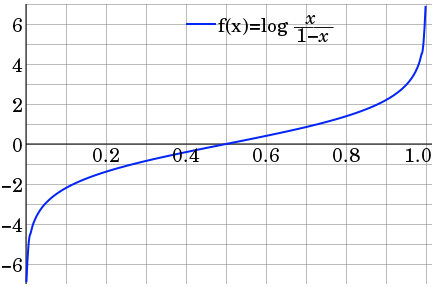
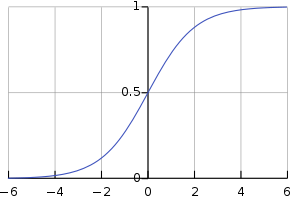
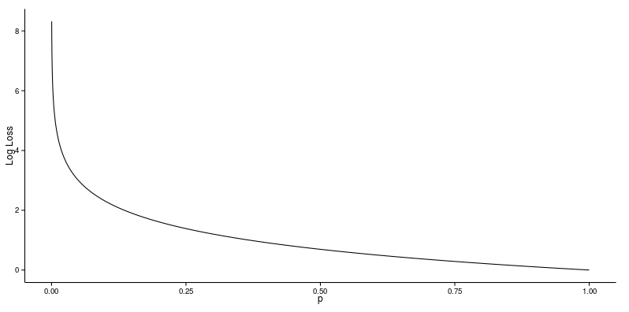
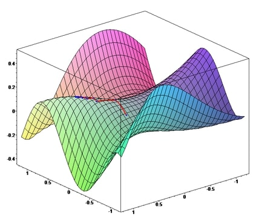
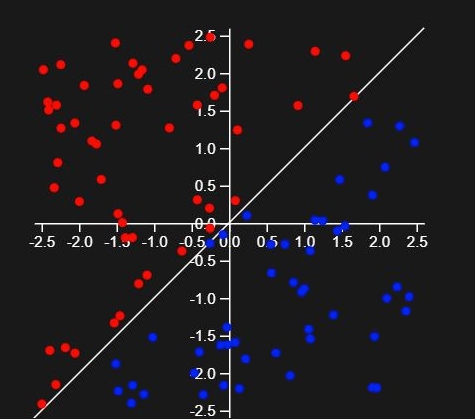
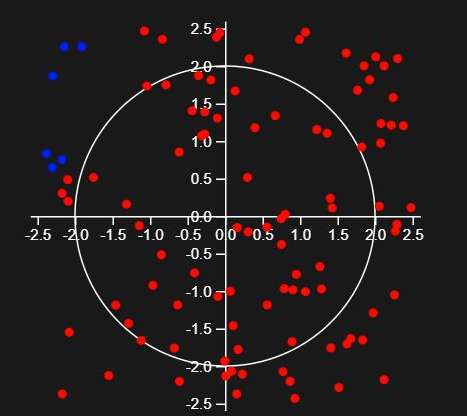
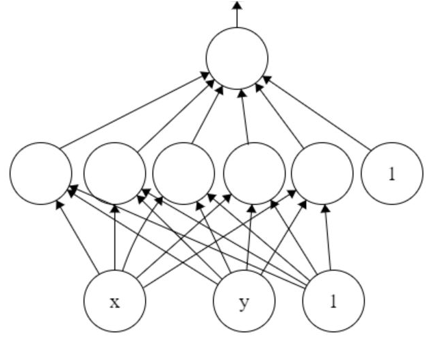
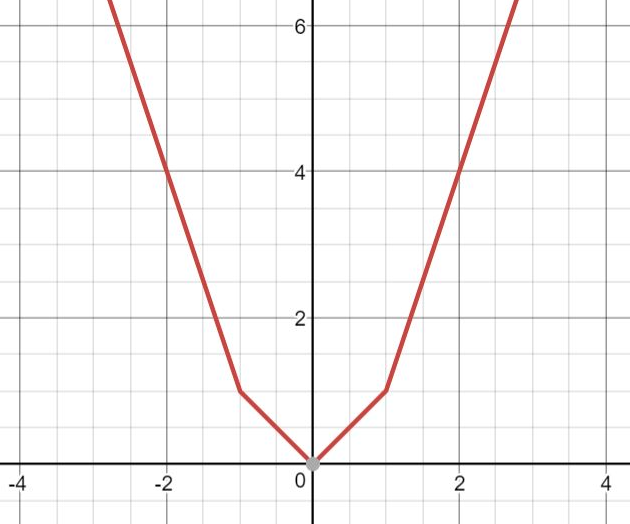
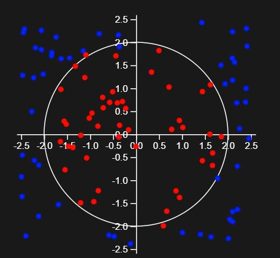
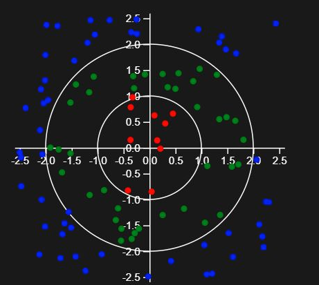

[↰](../note.md)

## Deep Learning with TensorFlow

- [Deep Learning with TensorFlow](#deep-learning-with-tensorflow)
  - [Introduction](#introduction)
  - [Model Initialization](#model-initialization)
  - [Logits](#logits)
  - [Metrics](#metrics)
  - [Optimization](#optimization)
  - [Training](#training)
  - [Evaluation](#evaluation)
  - [Linear Limitations](#linear-limitations)
  - [Hidden Layer](#hidden-layer)
  - [Multiclass](#multiclass)
  - [Softmax](#softmax)


### Introduction

What we will discover is called a **MultiLayer Perceptron** (MLP). It's basically a neuron systems with multiple layer. We will first start with 3 layers MLP. We have:
1. Input Layer
2. Hidden Layer
3. Output Layer

We will use **TensorFlow** (and not to build it from scratch like in [Make your own neural network](../../Make_your_neural_network/Note.md)). In TensorFlow, we first create the computation graph structure and then train and evaluate it. 

Common import of TensorFlow is `import tensorflow as tf`.

### Model Initialization

#### Placeholder

We need to have a placeholder for the input data and labels. We must use `tf.compat.v1.placeholder` or we won't be able to train our model on real data. 

We need to give as argument the type of placeholder. We have for `self.inputs` the type `tf.float32`. The label have a simpler type like `tf.int32`. We can also give a custom name to our placeholder with `name` keyword.

#### Shapes and dimensions

We must specify the shape of the data. We do this by passing through `shape` a tuple with the dimension of our data. Usually it will be `shape=(x,2)` with `x` being an integer.

#### Different amounts of data

We can also use the parameter `None` in place of a dimension size. When we use `None` in the `shape` tuple, it can take any size. It's more convenient since our data can take various sizes.

Simple creation of inputs placeholder:

```python
def init_inputs(input_size):
  inputs = tf.compat.v1.placeholder(tf.float32, shape=(None, input_size), name="inputs")
  return inputs
  ```

  And here for labels:
  ```python
  def init_labels(output_size):
  labels = tf.compat.v1.placeholder(tf.int32, shape=(None, output_size), name="labels")
  return labels
  ```

### Logits

First, we will just build our MLP with just an input and output layer. All the inputs node are connected to the outputs node. This is a *dense* graph implemented with `tf.keras.layers.Dense`. It takes in a neuron layer and output size. It then gives a fully connected output layer.

This function will adds another neuron called the *bias*. It is always of value of 1 and fully connected to the output.

#### Weighted connections

In neural network, we tweak the weight of the connections between the node. There is 3 cases:
- Positive weights: *direct* relationship.
- Zero weights: *no* relationship. 
- Negative weights: *inverse* relationship.

So each layer is a *linear combination.*

#### Logits

We use logits function to mimic how a neuron works.

$$f(x) = log\left(\frac{x}{1-x}\right)$$



We want to have probabilities so close to 0 result when wrong and 1 if right.

Here is how we create those dense graph with logits:

```python
def model_layers(inputs, output_size):
  logits = tf.keras.layers.Dense(output_size, name='logits')(inputs)
  return logits
```


### Metrics
Since our model outputs logits based on input data, we can inverse it using **sigmoid function**.



We use the built-in TF function `tf.math.sigmoid`. We can then see how sure a model is. If the output is close to 0 or 1 it is pretty confident.

#### Prediction

In NN we usually gonna round up the result to the closest integer. We can also use `tf.math.reduce_mean` which produces the overall mean of a tensor's numeric values.

```python
import tensorflow as tf
# predefine logits

probs = tf.math.sigmoid(logits)

rounded_probs = tf.math.round(probs)

predictions = tf.cast(rounded_probs, tf.int32)

is_correct = tf.math.equal(predictions, labels)

is_correct_float = tf.cast(is_correct, tf.float32)

accuracy = tf.math.reduce_mean(is_correct_float)
```

### Optimization

The weights are what we call *trainable variables*. It is with training we can improve the weights to produce more accurate data.

#### Loss as error

One of the most common loss function is the **L1 norm** and **L2 norm**:

$$\sum_i |actual_i - predicted_i| \qquad \qquad \sum_i (actual_i - predicted_i)^2$$

For prediction, an error is not too much of an issue. But for classification because of the binary nature of it it can lead to bigger problems.

#### Cross entropy

We can define the error like a probability  instead of just being wrong or right. So we want to have a small probability if we are close to the results and big if we are far away. 

We use the **cross entropy** also known as *log loss*:



#### Optimization

Now we can just minimize the cross entropy based on the model's logits and labels to get our optimal weights. We do this through gradient descent, where the model updates its weights based on a gradient of the loss function until it reaches the minimum loss (at which point the weights converge to the optimum). We use backpropagation to find the optimal gradient for the model to follow. Gradient descent is implemented as an object in TensorFlow, called `tf.compat.v1.train.GradientDescentOptimizer`.



We usually take a learning rate in the range of $[0.001; 0.1]$ to avoid overshoot. We set the learning rate with `learning_rate` when we initialize `Optimizer`.

An effective optimization method is **Adam** in TF `tf.compat.v1.train.AdamOptimizer`.

```python
labels_float = tf.cast(labels, tf.float32)

cross_entropy = tf.nn.sigmoid_cross_entropy_with_logits(labels=labels_float, logits=logits)

loss = tf.math.reduce_mean(cross_entropy)

adam = tf.compat.v1.train.AdamOptimizer()
train_op = adam.minimize(loss)
```


### Training

We will run our model in `tf.compat.v1.Session`. In this object, there is `run` which is why we've build everything so far.

#### Run

The required arguments is either a tensor/operation or a list/tuple of tensors and operations. The output of `run` is a tensor input in NumPy array. Here is an example with a constant tensor:

```python
with tf.compat.v1.Session() as sess:
    t = tf.constant([1, 2, 3])
    arr = sess.run(t)
    print('{}\n'.format(repr(arr)))

    t2 = tf.constant(4)
    tup = sess.run((t, t2))
    print('{}\n'.format(repr(tup)))
```

<details>
<summary>Output</summary>
<br>

```
array([1, 2, 3], dtype=int32)

(array([1, 2, 3], dtype=int32), 4)
```
</details>

The most important arguments is `feed_dict` where we give a dictionary where each key is a *tensor* from the model's computation graph.

```python
with tf.compat.v1.Session() as sess:
  inputs = tf.compat.v1.placeholder(tf.float32, shape=(None, 2))
  feed_dict = {
    inputs: [[1.1, -0.3],
            [0.2, 0.1]]
  }
  arr = sess.run(inputs, feed_dict=feed_dict)
  print('{}\n'.format(repr(arr)))
```

<details>
<summary>Output</summary>
<br>

```
array([[ 1.1, -0.3],
       [ 0.2,  0.1]], dtype=float32)
```
</details>

To correctly use this, we need to have each of the placeholder included as a key in `feed_dict`. With the corresponding value's shape and type matching the placeholder's.

#### Initializing variables

When we call run every tensors must either:

- Already have values
- Be fed in a value through `feed_dict`

If we start from scratch we are most likely to not have any values. We can initialize it with `tf.compat.v1.global_variables_initializer`.

```python
with tf.compat.v1.Session() as sess:
  inputs = tf.compat.v1.placeholder(tf.float32, shape=(None, 2))
  feed_dict = {
    inputs: [[1.1, -0.3],
            [0.2, 0.1]]
  }
  logits = tf.keras.layers.Dense(units=1, name='logits')(inputs)
  init_op = tf.compat.v1.global_variables_initializer()
  sess.run(init_op) # variable initialization
  arr = sess.run(logits, feed_dict=feed_dict)
  print('{}\n'.format(repr(arr)))
```

<details>
<summary>Output</summary>
<br>

```
array([[-1.018423  ],
       [-0.16056317]], dtype=float32)
```
</details>


#### Training logistics

We can specify the amount of iterations with the `num_steps` keyword.

```python
# predefined dataset
print('Input data:')
print('{}\n'.format(repr(input_data)))

print('Labels:')
print('{}\n'.format(repr(input_labels)))
```

<details>
<summary>Output</summary>
<br>

```
Input data:
array([[[ 1.2,  0.3],
        [ 0.1, -0.2],
        [-0.3,  0.3]],

       [[-2.1,  1.4],
        [-0.9,  0.6],
        [ 1.2,  2.2]],

       [[-1.1,  2.3],
        [ 1.1, -0.8],
        [ 1. ,  1.1]],

       [[ 1.4, -0.8],
        [ 1.2, -2. ],
        [ 1.1,  1.8]]])

Labels:
array([[[1],
        [0],
        [1]],

       [[0],
        [1],
        [1]],

       [[1],
        [0],
        [0]],

       [[0],
        [0],
        [0]]])
```
</details>

The batch size determines how the model trains. Larger batch sizes usually result in faster training but less accurate models, and vice-versa for smaller batch sizes. Choosing the batch size is a speed-precision tradeoff.

When training a neural network, it's usually a good idea to print out the loss every so often, so you know that the model is training correctly and to stop the training when the loss has converged to a minimum.

### Evaluation

We evaluate our AI thanks to a test set and we observe the prediction. We use the `accuracy` metric for this.

By using `None` as the number of rows, we can have a test set that is not the same size as the training set.
- Training set (~80% of dataset): Used for model training and optimization
- Validation set (~10% of dataset): Used to evaluate the model in between training runs, e.g. when tweaking model parameters like batch size
- Test set (~10% of dataset): Used to evaluate the final model, usually through some accuracy metric

```python
# test_data, test_labels, inputs, labels, accuracy
# are all predefined in the backend
feed_dict = {inputs: test_data, labels: test_labels}
eval_acc = sess.run(accuracy, feed_dict=feed_dict)
```

### Linear Limitations

On this example, we trained the perceptron to give use a label. So either 1 or 0. We trained it on 100 000 iterations of a batch size of 50. It gives this result in 2D:



If we train the perceptron to see if something is inside our outside a circle, it gives us this:



Here we see how the neural network does a pretty bad job. It's due to the lack of layers of perceptron. 2 layer just help us predicting *linear* data.

### Hidden Layer

#### Why a single layer is limited

Since without a hidden layer we can just simply do *linear combination*. But the circle is a second order equation.

#### Hidden layers

So to have a second order equation we can add a hidden layer. In our example we will add 5 new perceptron in the hidden layer.



#### Non-linearity

We add non-linearity by using *non-linear activation function* (the sigmoid function).

The most used function in deep learning:
1. tanh
2. ReLU
3. Sigmoid

ReLU is the best for most general-purpose situations.

#### ReLU

$$ReLU(x) = max(0,x)$$

It can seems pretty simple because it's simply a sort of $|x|$. But let's take:

$$f(x) = ReLU(x) + ReLU(-x) + ReLU(2x-2) + ReLU(-2x-2)$$



It looks like $x^2$. With enough linear combinations and ReLU activations, we can easily let it learn the quadratic transformation.

The key in this function is the simplicity of its gradient.

```python
def model_layers(inputs, output_size):
  print(inputs)

  hidden1_inputs = inputs
  hidden1 = tf.keras.layers.Dense(units=5, activation=tf.nn.relu, name="hidden1")(hidden1_inputs)

  logits_inputs = hidden1 #Change the input for the below logits layer here                      
  # Logits layer
  logits = tf.keras.layers.Dense(units=output_size,
                           name='logits')(logits_inputs)
  return hidden1_inputs, hidden1, logits_inputs, logits
  ```

  <details>
<summary>Output</summary>
<br>

```
Tensor("inputs:0", shape=(None, 2), dtype=float32)
```
</details>



### Multiclass

#### Multiclass classification

We know gonna see how to handle data where it can belong to multiple labels. For example:
- 0: Outside both circles
- 1: Inside the smaller circle
- 2: Outside the smaller circle but inside the larger circle

#### One-hot

Instead of representing each label as a single number, we use a one-hot vector. A one-hot vector has length equal to the number of classes, which is the same as ``output_size``. The vector contains a single 1 at the index of the class that the data point belongs to, i.e. the hot index, and 0's at the other indexes. The labels now become a set of one-hot vectors for each data point.

#### Adding hidden layers

Adding another hidden layer can be beneficial rather than having more nodes. Usually we keep the amount of hidden layers to 3.

When trying to solve a new problem, it's best to first start with one layer rather than putting 3 right from the start.

#### Overfitting

The more hidden layers there is the more it is subject to overfitting.


```python
def model_layers(inputs, output_size):
  hidden1_inputs = inputs
  hidden1 = tf.keras.layers.Dense(units=5,
                            activation=tf.nn.relu,
                            name='hidden1')(hidden1_inputs)
  hidden2_inputs = hidden1
  hidden2 = tf.keras.layers.Dense(units=5, activation=tf.nn.relu, name="hidden2")(hidden2_inputs)

  logits_inputs = hidden2 #Change the input for the logits layer
  logits = tf.keras.layers.Dense(units=output_size,
                           name='logits')(logits_inputs)
  return hidden1_inputs, hidden1, hidden2_inputs, hidden2, logits_inputs, logits
  ```

### Softmax

#### The softmax function

To convert the model for *multiclass classification* we need to do some change. To find the error we cannot use sigmoid on logits. We need to use the generalization of the sigmoid called **softmax function**.

It takes a vector of number then converts it into a probability distribution. We do this with the `tf.nn.softmax`:

```python
t = tf.constant([[0.4, -0.8, 1.3],
                 [0.2, -1.2, -0.4]])
softmax_t = tf.nn.softmax(t)
sess = tf.compat.v1.Session()
print('{}\n'.format(repr(sess.run(t))))
print('{}\n'.format(repr(sess.run(softmax_t))))
```

<details>
<summary>Output</summary>
<br>

```
array([[ 0.4, -0.8,  1.3],
       [ 0.2, -1.2, -0.4]], dtype=float32)

array([[0.2659011 , 0.08008787, 0.65401113],
       [0.5569763 , 0.13734867, 0.30567506]], dtype=float32)
```
</details>

We also replace the sigmoid cross entropy with the softmax cross entropy.

#### Predictions

So now the prediction is the class with the highest probability. So to find that label we use `tf.math.argmax` which takes a tensor and some keyword like `axis`. To find in the *final dimension* we use `axis=-1`.

```python
probs = tf.constant([[0.4, 0.3, 0.3],
                     [0.2, 0.7, 0.1]])
preds = tf.argmax(probs, axis=-1)
sess = tf.compat.v1.Session()
print('{}\n'.format(repr(sess.run(probs))))
print('{}\n'.format(repr(sess.run(preds))))
```

<details>
<summary>Output</summary>
<br>

```
array([[0.4, 0.3, 0.3],
       [0.2, 0.7, 0.1]], dtype=float32)

array([0, 1])
```
</details>

```python
probs = tf.nn.softmax(logits)
predictions = tf.math.argmax(probs, axis=-1)

class_labels = tf.argmax(labels, axis=-1)
is_correct = tf.equal(predictions, class_labels)

cross_entropy = tf.compat.v1.nn.softmax_cross_entropy_with_logits_v2(labels=labels, logits=logits)
```


[→](Deep_Learning_with_Keras.md)