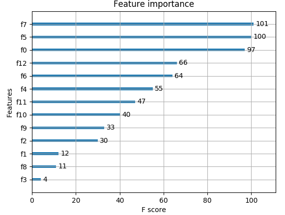

[↰](../note.md)

## Gradient Boosting with XGBoost

- [Gradient Boosting with XGBoost](#gradient-boosting-with-xgboost)
  - [Introduction](#introduction)
  - [XGBoost Basics](#xgboost-basics)
  - [Cross-Validation](#cross-validation)
  - [Storing Boosters](#storing-boosters)
  - [XGBoost Classifier](#xgboost-classifier)
  - [XGBoost Regressor](#xgboost-regressor)
  - [Feature Importance](#feature-importance)
  - [Hyperparameter Tuning](#hyperparameter-tuning)
  - [Model Persistence](#model-persistence)

### Introduction

XGBoost makes use of **gradient boosted decision trees** ramping up its speed. It's really faster for small and medium size datasets.

The main issue with regular decision tree is how bad it can grasp the tiny details and links between data. Cranking up the depth will just result in overfitting. Gradient boosting starts with a normal tree then adds more decision tree to correct itself.

### XGBoost Basics

The core data structure in XHBoost is the `DMatrix` which is a data matrix. We can construct it through a NumPy array. We can also do it with or without labels:

```python
data = np.array([
  [1.2, 3.3, 1.4],
  [5.1, 2.2, 6.6]])

import xgboost as xgb
dmat1 = xgb.DMatrix(data)

labels = np.array([0, 1])
dmat2 = xgb.DMatrix(data, label=labels)
```

It can be used for training with the object `Booster` (this is the actual gradient boosted decision tree):

```python
# predefined data and labels
print('Data shape: {}'.format(data.shape))
print('Labels shape: {}'.format(labels.shape))
dtrain = xgb.DMatrix(data, label=labels)

# training parameters
params = {
  'max_depth': 0,
  'objective': 'binary:logistic',
  'eval_metric':'logloss'
}
print('Start training')
bst = xgb.train(params, dtrain)  # booster
print('Finish training')
```

<details>
<summary>Output</summary>
<br>

```
Data shape: (569, 30)
Labels shape: (569,)
Start training
Finish training
```
</details>

When we train the data we not only give the Matrix but also the [parameters](https://xgboost.readthedocs.io/en/latest/parameter.html). We set `max_depth` to 0 so no limit of depth. The objective function is set to **binary classification**. We set the `eval_metric` to `logloss`. 

We can also evaluate the predictions like this:

```python
# predefined evaluation data and labels
print('Data shape: {}'.format(eval_data.shape))
print('Labels shape: {}'.format(eval_labels.shape))
deval = xgb.DMatrix(eval_data, label=eval_labels)

# Trained bst from previous code
print(bst.eval(deval))  # evaluation

# new_data contains 2 new data observations
dpred = xgb.DMatrix(new_data)
# predictions represents probabilities
predictions = bst.predict(dpred)
print('{}\n'.format(predictions))
```

<details>
<summary>Output</summary>
<br>

```
Data shape: (119, 30)
Labels shape: (119,)
[0]	eval-logloss:0.586757
[0.6236573 0.6236573]
```
</details>

The evaluation metric used here for binary classification (`eval-error`) represents the classification error,  which is the default `'eval_metric'` parameter for binary classification `Booster` models.

The prediction are probabilities rather than class labels. We can see it predicts either the class 0 or 1 in our example.

### Cross-Validation

We often need to tune all those parameters in XGBoost to find the best results. We can achieve this with *cross-validation*. We can use the `cv` function that performs cross-validation for a set of parameters.

```python
# predefined data and labels
dtrain = xgb.DMatrix(data, label=labels)
params = {
  'max_depth': 2,
  'lambda': 1.5,
  'objective':'binary:logistic',
  'eval_metric':'logloss'

}
cv_results = xgb.cv(params, dtrain)
print('CV Results:\n{}'.format(cv_results))
```

<details>
<summary>Output</summary>
<br>

```
CV Results:
   train-logloss-mean  train-logloss-std  test-logloss-mean  test-logloss-std
0            0.483158           0.003513           0.495192          0.004461
1            0.358339           0.002811           0.385320          0.003426
2            0.278666           0.004171           0.312824          0.001838
3            0.224486           0.005180           0.268105          0.001441
4            0.184866           0.006320           0.234053          0.003650
5            0.155553           0.006465           0.206154          0.005056
6            0.132931           0.008303           0.185956          0.005325
7            0.114835           0.008160           0.169282          0.006704
8            0.101367           0.008621           0.160168          0.005603
9            0.090693           0.009282           0.149912          0.008481
```
</details>

It gives us a *dataframe* and show the result for testing and training of a *K-fold* CV. We can set the amount of fold thanks to the parameter `nfold`.

The keyword argument `num_boost_round` specifies the number of boosting iterations. Each boosting iteration will try to improve the model through gradient boosting. The default number of iterations is 10.


### Storing Boosters

After finding the best parameters for a `Booster` we can save those into a *binary file*. We use the function `save_model`;

```python
# predefined data and labels
dtrain = xgb.DMatrix(data, label=labels)
params = {
  'max_depth': 3,
  'objective':'binary:logistic',
  'eval_metric':'logloss'
}
bst = xgb.train(params, dtrain)

# 2 new data observations
dpred = xgb.DMatrix(new_data)
print('Probabilities:\n{}'.format(
  repr(bst.predict(dpred))))

bst.save_model('model.bin')
```

<details>
<summary>Output</summary>
<br>

```
Probabilities:
array([0.10744555, 0.02841334], dtype=float32)
```
</details>

To load a saved model, we use the function `load_model`. We first need to initialize an empty `Booster` and then loads the data:

```python
# Load saved Booster
new_bst = xgb.Booster()
new_bst.load_model('model.bin')

# Same dpred from before
print('Probabilities:\n{}'.format(
  repr(new_bst.predict(dpred))))
```

<details>
<summary>Output</summary>
<br>

```
Probabilities:
array([0.10744555, 0.02841334], dtype=float32)
```
</details>

### XGBoost Classifier

XGBoost is faster to have model but actually using it is kinda tricky. We can have a "scikit-like" experience with a wrapper from XGBoost. This wrapper is called `XGBClassifier`:

```python
model = xgb.XGBClassifier(use_label_encoder=False, eval_metric='logloss')
# predefined data and labels
model.fit(data, labels)

# new_data contains 2 new data observations
predictions = model.predict(new_data)
print('Predictions:\n{}'.format(repr(predictions)))
```

<details>
<summary>Output</summary>
<br>

```
Predictions:
array([0, 1])
```
</details>

When we use the predict, it just returns us the result not the probabilities. All the parameters are now simply keywords:

```python
model = xgb.XGBClassifier(objective='multi:softmax', eval_metric='mlogloss', use_label_encoder=False)
# predefined data and labels (multiclass dataset)
model.fit(data, labels)

# new_data contains 2 new data observations
predictions = model.predict(new_data)
print('Predictions:\n{}'.format(repr(predictions)))
```

<details>
<summary>Output</summary>
<br>

```
Predictions:
array([2, 0])
```
</details>


### XGBoost Regressor

We can also do this for **Regressor** with `XGBRegressor` object:

```python
model = xgb.XGBRegressor(max_depth=2)
# predefined data and labels (for regression)
model.fit(data, labels)

# new_data contains 2 new data observations
predictions = model.predict(new_data)
print('Predictions:\n{}'.format(repr(predictions)))
```

<details>
<summary>Output</summary>
<br>

```
Predictions:
array([25.591753, 13.374372], dtype=float32)
```
</details>

### Feature Importance

#### Determining important features

In such tree, some labels are far less important than others so it's important what are the most important one. In XGBoost after training, we can find the most important thanks to `feature_importances_`:

```python
model = xgb.XGBClassifier(objective='multi:softmax', eval_metric='mlogloss', use_label_encoder=False)
# predefined data and labels
model.fit(data, labels)

# Array of feature importances
print('Feature importances:\n{}'.format(
  repr(model.feature_importances_)))
```

<details>
<summary>Output</summary>
<br>

```
Feature importances:
array([0.00959796, 0.01645038, 0.67658573, 0.29736587], dtype=float32)
```
</details>

#### Plotting important features

We can also easily plot this with XGBoost and matplotlib:
```python
model = xgb.XGBRegressor()
# predefined data and labels (for regression)
model.fit(data, labels)

xgb.plot_importance(model)
plt.show() # matplotlib plot
```
<details>
<summary>Output</summary>
<br>



</details>

Each bar represent the **F-scores** and the number next to each of the bars is the exact F-score.

We can also plot it with the **information gain** as the metric:

```python
model = xgb.XGBRegressor()
# predefined data and labels (for regression)
model.fit(data, labels)

xgb.plot_importance(model, importance_type='gain')
plt.show() # matplotlib plot
```

<details>
<summary>Output</summary>
<br>


</details>

It shows us how good a feature is at differentiating the dataset.

We can also remove the values on the graph with the keyword `show_values` set to `False`.

### Hyperparameter Tuning

By using the wrapper, we can actually use the grid search cv with `GridSearchCV` wrapper:

```python
model = xgb.XGBClassifier(objective='binary:logistic', eval_metric='logloss', use_label_encoder=False)
params = {'max_depth': range(2, 5)}

from sklearn.model_selection import GridSearchCV
cv_model = GridSearchCV(model, params, cv=4)

# predefined data and labels
cv_model.fit(data, labels)
print('Best max_depth: {}\n'.format(
  cv_model.best_params_['max_depth']))

# new_data contains 2 new data observations
print('Predictions:\n{}'.format(
  repr(cv_model.predict(new_data))))
```

<details>
<summary>Output</summary>
<br>

```
Best max_depth: 4

Predictions:
array([0, 1])
```
</details>

Here we applied the algorithm to a *binary classification XGBoost model*. We wanted the best depth between $[2; 4]$

The official XGBoost documentation provides a [list](https://xgboost.readthedocs.io/en/latest/parameter.html) of the possible parameters we can tune for in a model. A couple commonly tuned parameters are `'max_depth'` and `'eta'` (the learning rate of the boosting algorithm).

### Model Persistence

We can save and load the `XGBClassifier` and `XGBRegressor` as we used in scikit. We use the *joblib* API. We use the `dump` and `load` in our case.


[→](Deep_Learning_with_TensorFlow.md)