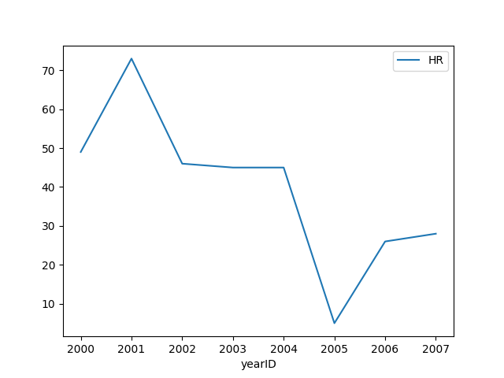

# Machine Learning with NumPy, pandas, scikit-learn, and More
- [Machine Learning with NumPy, pandas, scikit-learn, and More](#machine-learning-with-numpy-pandas-scikit-learn-and-more)
  - [Introduction](#introduction)
  - [Data Manipulation with NumPy](#data-manipulation-with-numpy)
  - [Data Analysis with pandas](#data-analysis-with-pandas)
  - [Data Preprocessing with scikit-learn](#data-preprocessing-with-scikit-learn)
  - [Data Modeling with scikit-learn](#data-modeling-with-scikit-learn)
  - [Clustering with scikit-learn](#clustering-with-scikit-learn)
  - [Gradient Boosting with XGBoost](#gradient-boosting-with-xgboost)
  - [Deep Learning with TensorFlow](#deep-learning-with-tensorflow)
  - [Deep Learning with Keras](#deep-learning-with-keras)

## Introduction

### What is Machine Learning
We have different type of Machine Learning or ML:
- **Supervised learning**: we label data to train a model. Example a set of handwritten number that already have the right answer tied with the data. (similar to this [summary](https://github.com/Tfloow/Educative/blob/main/Make_your_neural_network))
- **Unsupervised learning**: we let the model make relationships between data. Most data out here are unlabeled. So the goal is not give a precise answer but rather cluster each data together.

### ML vs. AI vs. data science
They do not mean the same. ML is part of AI and AI overlaps with data science. There is also other way to make AI (like alpha-beta pruning, rule-based systems, ...)

### 7 steps of the machine learning process
1. **Data Collection**: one of the most important step to gather good quality data.
2. **Data Processing and Preparation**: make sure it's in the right shape to be fed into our model. (handling missing data, dealing with outliers, errors, ...)
3. **Feature Engineering**: choose to remove some features of the data to optimize the runtime.
4. **Model Selection**: usually we don't start with all new models but rather reuse and tweak some.
5. **Model Training and Data Pipeline**: then we need to choose a data pipeline. Making sure we always have a batch of data ready to be fed.
6. **Model Validation**: we need to use never seen before data by the model so we can test and validate it.
7. **Model Persistence**: then we need to save the crucial part! The

## Data Manipulation with NumPy
*This chapter mostly covers previously learned topics so I will just write down some useful info only*.

- Casting: we can cast an entire array using `arr.astype(type)`.
- Filler: we use `np.nan` as a placeholder for missing data.
- Linspace: we can use `np.linspace(start, finish)` and there is some useful argument:
  - `num`: indicates the number of element we want in (set to 50 by default)
  - `endpoint`: if we want the last number (like in `np.arange` if `False`)
  - `dtype`: the encoded type of number
- Flatten: the inverse of reshape, it turns an array back to a 1D array. So something of shape `(x,)`. (notice it's `(x,)` and not `(x,y)`).
- Transpose: it's like the `.T` but we can set how the data will transpose with `np.transpose(arr, axes=(1, 2, 0))`.
- Like: we can create zeros and ones matrix by looking at the shape of other with `np.ones_like(matrix)`.

### Random
- `np.random.randint(x)`:
  - `x`: represent the upper bound starting from 0.
  - `high`: represent the upper bound, so `x` becomes the lower bound.
  - `size`: help us choose the size of the returned array.
- `np.random.seed(x)`: to generate a pseudo-random function with a specific seed.
- `np.random.shuffle(x)`: shuffle an array (only its first dimension).
- `np.random.uniform(x)`: draw samples form probability distributions (takes the same parameters as `np.random.randint()`).
- `np.random.normal(x)`: same as `np.random.uniform(x)` but with a normal gaussian distribution.

We also have custom smapling! Useful to choose (pseudo-)randomly from a set like:
```python
colors = ['red', 'blue', 'green']
print(np.random.choice(colors))
print(repr(np.random.choice(colors, size=2)))
print(repr(np.random.choice(colors, size=(2, 2),
                            p=[0.8, 0.19, 0.01])))
```
`p` helps us choose the distribution of probability among the list of possibilities.

### Slicing
```python
arr = np.array([[1, 2, 3],
                [4, 5, 6],
                [7, 8, 9]])
print(repr(arr[:, -1]))
# array([3, 6, 9])
print(repr(arr[:, 1:]))
# array([[2, 3],
#       [5, 6],
#       [8, 9]])
```
We can use `argmin()` to find the minimum in an array. We can specify the axis thanks to the argument `axis=`. Each number represent the dimension. (eg: 0 equals to the colums, 1 to the rows, ...)

### Filtering Data
If we have an array we can compare it like this `print(arr == 1)` and it will print us an array with boolean value. We also can use `~` for the negation. We can find `NaN` by printing `print(np.isnan(arr))` to show the `NaN` location.

We can filter data thanks to `np.where()`. We pass as argument a comparison to do between our array and a specific value:
```python
arr = np.array([1,0,1])
print(np.where(arr == 1))
# [0, 2]

arr = np.array([[0, 0, 3],
                [1, 0, 0],
                [-3, 0, 0]])
x_ind, y_ind = np.where(arr != 0)
print(x_ind)
print(ry_ind)
```
It really shines when we pass *3* arguments. We can have then our comparison, then an array in case it's `True` and another in case it's `False`:
```python
np_filter = np.array([[True, False], [False, True]])
positives = np.array([[1, 2], [3, 4]])
negatives = np.array([[-2, -5], [-1, -8]])
print(np.where(np_filter, positives, negatives))
# [[ 1, -5],
#  [-1,  4]]
```
We can also use a constant arguments for `positives` and `negatives`.

If we want to compare the matrix as a whole we can use `np.any()` to see if anything in the array match the condition or `np.all()` if they all do. We can also choose the axis we want to do the comparison. We can also combine all of this:
```python
arr = np.array([[-2, -1, -3],
                [4, 5, -6],
                [3, 9, 1]])
has_positive = np.any(arr > 0, axis=1)
print(has_positive)
# [False  True  True]
print(arr[np.where(has_positive)])
# array([[ 4,  5, -6],
#       [ 3,  9,  1]])
```

### Statistics
We can get the minimum value and the maximum thanks to `arr.min()` and `arr.max()`. If we specify the argument `axis` we will get a row or a column with the smallest or biggest subarray. 

We have also some useful other methods for statistics such as:
- `np.mean()`: To get the average.
- `np.var()`: To get the variance.
- `np.median()`: To get the median. (Not: if no axis is precised, it will simply **flattened** the array)

### Aggregation

To sum all the values of ana rray, we use `np.sum()` to sum. We can pass `axis` to specify if we need to sum along the row or columns.

If we want to use the cumulative sum we can use `np.cumsum()`:
```python
arr = np.array([[0, 72, 3],
                [1, 3, -60],
                [-3, -2, 4]])
print(np.cumsum(arr))
# [ 0, 72, 75, 76, 79, 19, 16, 14, 18]
```

How to concatenate ? We can do it thanks to `np.concatenate()`. We concatenate along one on the axis so we must specify it thanks to `axis=`.

### Saving Data
We can save an object in NumPy by using `np.save(*.npy, arr)`. We need to save it in `.npy` extension to be reused by NumPy. Using this extension will make the raw data harder to process by a human.

To load the data, we simply do `arr = np.load(*.npy)`

## Data Analysis with pandas
For this we are gonna use some data that were found [here](http://seanlahman.com/download-baseball-database/)

### Series
Series is the object in pandas to deal with 1D data. we create this `pandas.Series` thanks to its constructor. It takes as *first* arguments some data and can also use the `dtype` argument. (this time we use `"float64"` instead of `np.float` but we can still use NumPy data type and format) We can multiply a serie with a simple list array.

```python
series = pd.Series([1, 2, 3])
print(f"{series}\n")
# 0    1
# 1    2
# 2    3
# dtype: int64
```
We see that the index of our series are display on the left hand side. Usually it goes from $0$ up to $n-1$. But we can specify our index thanks to the `index` parameter when creating a new Serie.
```python
series = pd.Series([1, 2, 3], index=['a', 'b', 'c'])
print(f"{series}\n")
# a    1
# b    2
# c    3
# dtype: int64
```
Pandas also support series loaded from a *dictionary*. It will make the keys of the dictionary the index and the value of the dictionary the value of the serie.

### Dataframe
Pandas use Dataframe to handle 2D array. It's the most important object in pandas because it will help us handle tables, spreadsheets, ... The object name is `pandas.DataFrame`. It takes the same arguments as a Serie but with another parameter called `columns`.

In pandas when we have multiple format type of data we do what we call an **upcasting**. We change the type of the data to the highest one in the column.
```python
upcast = pd.DataFrame([[5, 6], [1.2, 3]])
print('{}\n'.format(upcast))
#      0  1
# 0  5.0  6
# 1  1.2  3
print(upcast.dtypes)
# 0    float64
# 1      int64
# dtype: object
```
We can append a row of data to an existing dataframe. **Watch out** : it doesn't change the old DF but return a new one. To have an unified index we can use `ignore_index=True`.

To drop lines in pandas, we use the `df.drop()`. We don't need an arguments but we can use some parameters:
- `label`: to define which row to delete.
- `axis`: to choose if we drop rows (0) or columns (1)
- `index`: to drow a row.
- `columns`: so no need to use label and axis, we immediatly specify the column to drop.

We can use `index` and `columns` together and even list.

### Combining
Here, we are gonna see how we can concatenate multiple DataFrame. We use `pd.concat()`. We pass an **array** of DF. We can choose the ``axis``. If we set to 1 then we had to the right. **Watch out**: if we had some data to the right and the two DF don't share the same index, then it will form this:
```python
df1 = pd.DataFrame({'c1':[1,2], 'c2':[3,4]},
                   index=['r1','r2'])
df3 = pd.DataFrame({'c1':[5,6], 'c2':[7,8]})

concat = pd.concat([df1, df3], axis=1)
print('{}\n'.format(concat))
#      c1   c2   c1   c2
# r1  1.0  3.0  NaN  NaN
# r2  2.0  4.0  NaN  NaN
# 0   NaN  NaN  5.0  7.0
# 1   NaN  NaN  6.0  8.0
```
We can also *merge* DF together ! Thank to `pd.merge(df1, df2)`. It merges two DataFrames using their **common column labels**. If 2 data differs, pandas will use the data from `df2` and add a column describing how alike the two data are thaks to `rbi` column.

### Indexing
Now we will see how we retrieve data:
```python
df = pd.DataFrame({'c1': [1, 2], 'c2': [3, 4],
                   'c3': [5, 6]}, index=['r1', 'r2'])
col1 = df['c1']
# Newline for separating print statements
print('{}\n'.format(col1))

col1_df = df[['c1']]
print('{}\n'.format(col1_df))

col23 = df[['c2', 'c3']]
print('{}\n'.format(col23))
```
<details>
<summary>Output</summary>
<br>

```
r1    1
r2    2
Name: c1, dtype: int64

    c1
r1   1
r2   2

    c2  c3
r1   3   5
r2   4   6
```
</details>


We can see that if we use a **single** name of a colum, we get a Series. If we use **double** bracket like `[['c1']]` we get a DF as an output.

To get rows, we can simply use number as we would do  with list in Python.

There is other way to index. DF also contains `loc` and `iloc`. If we use `iloc`, we can get rows based on int. We can give integers or list of integers:

```python
df = pd.DataFrame({'c1': [1, 2, 3], 'c2': [4, 5, 6],
                   'c3': [7, 8, 9]}, index=['r1', 'r2', 'r3'])
                   
print('{}\n'.format(df))

print('{}\n'.format(df.iloc[1]))

print('{}\n'.format(df.iloc[[0, 2]]))

bool_list = [False, True, True]
print('{}\n'.format(df.iloc[bool_list]))
```
<details>
<summary>Output</summary>
<br>

```
    c1  c2  c3
r1   1   4   7
r2   2   5   8
r3   3   6   9

c1    2
c2    5
c3    8
Name: r2, dtype: int64
```
</details>

The `loc` works like iloc but we need to use **row label**. We can perform column indexing with row indexing, and set new values in a DF for specific rows and columns:
```python
df = pd.DataFrame({'c1': [1, 2, 3], 'c2': [4, 5, 6],
                   'c3': [7, 8, 9]}, index=['r1', 'r2', 'r3'])
                   
print('{}\n'.format(df))

print('{}\n'.format(df.loc['r2']))

bool_list = [False, True, True]
print('{}\n'.format(df.loc[bool_list]))

single_val = df.loc['r1', 'c2']
print('Single val: {}\n'.format(single_val))

print('{}\n'.format(df.loc[['r1', 'r3'], 'c2']))

df.loc[['r1', 'r3'], 'c2'] = 0
print('{}\n'.format(df))
```
<details>
<summary>Output</summary>
<br>

```
    c1  c2  c3
r1   1   4   7
r2   2   5   8
r3   3   6   9

c1    2
c2    5
c3    8
Name: r2, dtype: int64

    c1  c2  c3
r2   2   5   8
r3   3   6   9

Single val: 4

r1    4
r3    6
Name: c2, dtype: int64

    c1  c2  c3
r1   1   0   7
r2   2   5   8
r3   3   0   9
```
</details>


### File I/O
Now we will learn how to read dat from various type of format.

#### Read CSV
We use `read_csv()`. We sepcify the filepath. By default, the index is simply numbered from 0 to n-1. If we want to specify which columns should be used for index, we use `index_col`.

#### Read XLSX (Excel)
We use `read_excel()`. It's a bit different than CSV because a XLSX can have other spreadsheet. We need to precise which sheet we want to use thanks to `sheet_name`. We can pass a `None` or a list of number and we will have a dictionary of DF.

#### Read JSON
We use `read_json()`. We can change the orientation as the JSON is read by passing the `orient` parameter. We can use `"index"` to transpose it.

#### Write CSV
We write with `to_csv()`. It can save without any specified name. We can say we don't need the index by passing `index=False`.

#### Write XLSX
We write with `to_excel()`. To open an excel notebook we need more work like this:
```python
with pd.ExcelWriter('data.xlsx') as writer:
  mlb_df1.to_excel(writer, index=False, sheet_name='NYY')
  mlb_df2.to_excel(writer, index=False, sheet_name='BOS')
```

#### Write JSON
We write with `to_json()`. It takes the same parameter as in `read_json()`.

### Grouping
When we have a large set of data it's usually ideal to group them by common categories. We can do this thanks to `groupby()`. We can pass a specific column.

```python
# Predefined df of MLB stats
print('{}\n'.format(df))

groups = df.groupby('yearID')
for name, group in groups:
  print('Year: {}'.format(name))
  print('{}\n'.format(group))
  
print('{}\n'.format(groups.get_group(2016)))
print('{}\n'.format(groups.sum()))
print('{}\n'.format(groups.mean()))
```
<details>
<summary>Output</summary>
<br>

```
   yearID teamID     H    R
0    2017    CLE  1449  818
1    2015    CLE  1395  669
2    2016    BOS  1598  878
3    2015    DET  1515  689
4    2016    DET  1476  750
5    2016    CLE  1435  777
6    2015    BOS  1495  748
7    2017    BOS  1461  785
8    2017    DET  1435  735

Year: 2015
   yearID teamID     H    R
1    2015    CLE  1395  669
3    2015    DET  1515  689
6    2015    BOS  1495  748

Year: 2016
   yearID teamID     H    R
2    2016    BOS  1598  878
4    2016    DET  1476  750
5    2016    CLE  1435  777

Year: 2017
   yearID teamID     H    R
0    2017    CLE  1449  818
7    2017    BOS  1461  785
8    2017    DET  1435  735

   yearID teamID     H    R
2    2016    BOS  1598  878
4    2016    DET  1476  750
5    2016    CLE  1435  777

           H     R
yearID            
2015    4405  2106
2016    4509  2405
2017    4345  2338

                  H           R
yearID                         
2015    1468.333333  702.000000
2016    1503.000000  801.666667
2017    1448.333333  779.333333
```
</details>


Here, the grouping produced 3 DF for each years. We can get them thanks to the `groups` variable. We then use `sum` and `mean` function to perform analytics. We can also *filter* thanks to the `filter` function.
```python
no2015 = groups.filter(lambda x: x.name > 2015)
print(no2015)
```
<details>
<summary>Output</summary>
<br>

```
   yearID teamID     H    R
0    2017    CLE  1449  818
2    2016    BOS  1598  878
4    2016    DET  1476  750
5    2016    CLE  1435  777
7    2017    BOS  1461  785
8    2017    DET  1435  735
```y(['cruzne02', 'pedrodu01', 'troutmi01'], dtype=object)
```
</details>


We can also group by **multiple** columns if we pass in `groupby()` a list of columns.


### Features
We often refer to the columns of a DF as the features. Those features can be **quantitative** or **categorical**. *Quantitative* is something that can be measured. Categorical is something that is useful paired with a `groupby()`.

we can sum a DF, show the mean and in those two case we can choose the axis by passing `axis` as a parameter.

We can also apply some weights to some data. We use the `multiply` function. `multiply` takes a list of weight or a constant. 

### Filtering
We can also do the same as in NumPy for DF by doing comparison. For example, we can put a condition on a specific column. Some useful function:
- `str.startwith()`: we want the word to start with a specific string
- `str.endwith()`: we want the word to end with a specific string
- `str.contains()`: we want the word to contain a specific string.

We can also use `.isin([a, b, ...])` which does multiple comparison.

To find if a data is missing we can use the `isna()` or not with `notna()`.

It is also pretty easy to filter DF's row with some conditions. we do this:
```python
hr40_df = df[df['HR'] > 40]
print('{}\n'.format(hr40_df))
```

<details>
<summary>Output</summary>
<br>

```
   playerID  yearID teamID  HR
2  cruzne02    2016    SEA  43
```
</details>

### Sorting
To sort in pandas, we use `sort_values()`. It takes as first argument the column we want to sort and we can set it into ascending or descending order thanks to `ascending`. We can also sort multiple columns when usinig a list of columns name.


### Metrics
In pandas, rather than just computing everything by hand, we can have a description with useful data about the DF with `describe`. It returns an usefule DF with this init:
| Metric |                                 Description                                 |
| :----: | :-------------------------------------------------------------------------: |
| count  |                     The number of rows in the DataFrame                     |
|  mean  |                        The mean value for a feature                         |
|  std   |                    The standard deviation for a feature                     |
|  min   |                       The minimum value in a feature                        |
|  25%   |                      The 25th percentile of a feature                       |
|  50%   | The 50th percentile of a feature. Note that this is identical to the median |
|  75%   |                      The 75th percentile of a feature                       |
|  max   |                       The maximum value in a feature                        |

We can also set the percentiles ourself by passing a list like `percentiles=[.2, .8]`.

#### Categorical Features
We cannot really compute or sum *categorical* features so we need to use `value_counts()` that simply count the recurrence. We also can sort by ascending or descending thanks to `ascending` or even *normalize* the data thanks to `normalize`.

Something also useful is to get each *unique* data  that apperars in a column. We do this thanks to `unique()`.
```python
unique_players = df['playerID'].unique()
print('{}\n'.format(repr(unique_players)))
```

<details>
<summary>Output</summary>
<br>

```
array(['cruzne02', 'pedrodu01', 'troutmi01'], dtype=object)
```
</details>

### Plotting
To plot a DF we need to combine **matplotlib** and DF:
```python
print('{}\n'.format(df))

df.plot(kind='line',x='yearID',y='HR')
plt.show()
```
Output:


### To Numpy
DF is useful for storing data but not that fast and it's not so convenient with ML framework so we need to make our life easier and use NumPy.

When we deal with categorical data, we need to convert them to quantitative data to be useful with NumPy:
```python
# predefined non-indicator DataFrame
print('{}\n'.format(df))

# predefined indicator Dataframe
print('{}\n'.format(indicator_df))
```

<details>
<summary>Output</summary>
<br>

```
    color
r1    red
r2   blue
r3  green
r4    red
r5    red
r6   blue

    blue  red  green
r1     0    1      0
r2     1    0      0
r3     0    0      1
r4     0    1      0
r5     0    1      0
r6     1    0      0
```
</details>

To have this result we must transform our initial dataframe:
1. Transform it with `get_dummies(df)`
2. Slice the converted data. `get_dummies` will give us $\sum_i col_i \times possibilities_i$. So we need to split it back into $col_i$ DF.
```python
print('{}\n'.format(df))

converted = pd.get_dummies(df)
print('{}\n'.format(converted.columns))

print('{}\n'.format(converted[['teamID_BOS',
                               'teamID_PIT']]))
print('{}\n'.format(converted[['lgID_AL',
                               'lgID_NL']]))
```
Then to convert to NumPy, we can simply (*after doing the 2 first steps*) do `df.values`.
## Data Preprocessing with scikit-learn
Scikit is closer to what data scientist will tend to use when analyzing data. We can work on smaller scale data.

### Standardizing Data
Because data can vary drastically (weights in kilo vs. weights in pounds, speed of light vs. speed of a car) we want to give them some more depth and information. We will use the **standard format**. It refers to data that has 0 *mean* and an unit variance (1). We do a *data standardization*.

To do so, we simply use a data $x$ that we substract the mean the data $\mu$ and divide by the *standard deviation* $\sigma$. It gives us a new value called $z$:
$$z = \frac{x-\mu}{\sigma}$$

To use scikit and feed some data, we mostly need inputs coming from NumPy. To do some preprocessing we need to use the module `sklearn.preprocessing`.

```python
# predefined pizza data
# Newline to separate print statements
print('{}\n'.format(repr(pizza_data)))

from sklearn.preprocessing import scale
# Standardizing each column of pizza_data
col_standardized = scale(pizza_data)
print('{}\n'.format(repr(col_standardized)))

# Column means (rounded to nearest thousandth)
col_means = col_standardized.mean(axis=0).round(decimals=3)
print('{}\n'.format(repr(col_means)))

# Column standard deviations
col_stds = col_standardized.std(axis=0)
print('{}\n'.format(repr(col_stds)))
```

<details>
<summary>Output</summary>
<br>

```
array([[2100,   10,  800],
       [2500,   11,  850],
       [1800,   10,  760],
       [2000,   12,  800],
       [2300,   11,  810]])

array([[-0.16552118, -1.06904497, -0.1393466 ],
       [ 1.4896906 ,  0.26726124,  1.60248593],
       [-1.40693001, -1.06904497, -1.53281263],
       [-0.57932412,  1.60356745, -0.1393466 ],
       [ 0.66208471,  0.26726124,  0.2090199 ]])

array([ 0., -0.,  0.])

array([1., 1., 1.])
```
</details>

The last two prints illustrate that we indeed calculate the standard format. We can also standardize data along rows by adding the parameter `axis=1`.

### Data Range
We can also compress data into a fixed rage. So we usually use it with the range of $[0, 1]$.
$$x_{prop} = \frac{x - d_{min}}{d_{max} - d_{min}}$$
This only works if $d_{max} \neq d_{min}$. Then we need to use the proportion to scale the data to the specified range:
$$x_{scale} = x_{prop} \cdot (r_{max} - r_{min}) + r_{min}$$
To do this in scikit we use the object `MinMaxScaler`.

```python
# predefined data
print('{}\n'.format(repr(data)))

from sklearn.preprocessing import MinMaxScaler
default_scaler = MinMaxScaler() # the default range is [0,1]
transformed = default_scaler.fit_transform(data)
print('{}\n'.format(repr(transformed)))

custom_scaler = MinMaxScaler(feature_range=(-2, 3))
transformed = custom_scaler.fit_transform(data)
print('{}\n'.format(repr(transformed)))
```

<details>
<summary>Output</summary>
<br>

```
array([[ 1.2,  3.2],
       [-0.3, -1.2],
       [ 6.5, 10.1],
       [ 2.2, -8.4]])

array([[0.22058824, 0.62702703],
       [0.        , 0.38918919],
       [1.        , 1.        ],
       [0.36764706, 0.        ]])

array([[-0.89705882,  1.13513514],
       [-2.        , -0.05405405],
       [ 3.        ,  3.        ],
       [-0.16176471, -2.        ]])
```
</details>

### Robust Scaling
Dealing with *outliers* is really common when treating with data (especially big one). The issue with our 2 previous methode is that they are affected by outliers which could degrade the quality of our data.

To avoid being affected by outliers, we can use IQR or **Interquartile range**. Those are percentiles (25%, 50% and 75%). We need to call `RobustScaler` for it:
```python
# predefined data
print('{}\n'.format(repr(data)))

from sklearn.preprocessing import RobustScaler
robust_scaler = RobustScaler()
transformed = robust_scaler.fit_transform(data)
print('{}\n'.format(repr(transformed)))
```
<details>
<summary>Output</summary>
<br>

```
array([[ 1.2,  2.3],
       [ 2.1,  4.2],
       [-1.9,  3.1],
       [-2.5,  2.5],
       [ 0.8,  3. ],
       [ 6.3,  2.1],
       [-1.5,  2.7],
       [ 1.4,  2.9],
       [ 1.8,  3.2]])

array([[ 0.        , -1.        ],
       [ 0.27272727,  2.16666667],
       [-0.93939394,  0.33333333],
       [-1.12121212, -0.66666667],
       [-0.12121212,  0.16666667],
       [ 1.54545455, -1.33333333],
       [-0.81818182, -0.33333333],
       [ 0.06060606,  0.        ],
       [ 0.18181818,  0.5       ]])
```
</details>

### Normalizing Data
We normalize data thanks to L2 normalization. We do a row normalization by dividing everything by the row's L2 norm. Let's see how L2 normalization work with the row $X$:
$$X = [x_1, x_2, ..., x_m]$$
$$X_{L2} = [\frac{x_1}{\ell}, \frac{x_2}{\ell}, ..., \frac{x_M}{\ell}], \text{where } \ell = \sqrt{\sum_{i=1}^{m} x_i^2}$$
The module in scikit that implements this is named `Normalizer`.
```python
# predefined data
print('{}\n'.format(repr(data)))

from sklearn.preprocessing import Normalizer
normalizer = Normalizer()
transformed = normalizer.fit_transform(data)
print('{}\n'.format(repr(transformed)))
```

<details>
<summary>Output</summary>
<br>

```
array([[4, 1, 2, 2],
       [3, 4, 0, 0],
       [7, 5, 9, 2]])

array([[0.8       , 0.2       , 0.4       , 0.4       ],
       [0.6       , 0.8       , 0.        , 0.        ],
       [0.55513611, 0.39652579, 0.71374643, 0.15861032]])
```
</details>

### Data Imputation
If we are missing some data, we can do what is called a **data imputation**. It lets us *substitute* the missing data with some other value. For now, we will use `SimpleImputer` that perform 4 data imputation methods:
1. Using the mean value
2. Using the median value
3. Using the most frequent value
4. Filling in missing values with a constant

```python
# predefined data
print('{}\n'.format(repr(data)))

from sklearn.impute import SimpleImputer
imp_mean = SimpleImputer()
transformed = imp_mean.fit_transform(data)
print('{}\n'.format(repr(transformed)))
```
<details>
<summary>Output</summary>
<br>

```
array([[ 1.,  2., nan,  2.],
       [ 5., nan,  1.,  2.],
       [ 4., nan,  3., nan],
       [ 5.,  6.,  8.,  1.],
       [nan,  7., nan,  0.]])

array([[1.  , 2.  , 4.  , 2.  ],
       [5.  , 5.  , 1.  , 2.  ],
       [4.  , 5.  , 3.  , 1.25],
       [5.  , 6.  , 8.  , 1.  ],
       [3.75, 7.  , 4.  , 0.  ]])
```
</details>

When initializing our `SimpleInputer`, we can set the strategy thanks to the parameter `strateger=`. 

```python
# predefined data
print('{}\n'.format(repr(data)))

from sklearn.impute import SimpleImputer
imp_median = SimpleImputer(strategy='median')
transformed = imp_median.fit_transform(data)
print('{}\n'.format(repr(transformed)))

imp_frequent = SimpleImputer(strategy='most_frequent')
transformed = imp_frequent.fit_transform(data)
print('{}\n'.format(repr(transformed)))
```

<details>
<summary>Output</summary>
<br>

```
array([[ 1.,  2., nan,  2.],
       [ 5., nan,  1.,  2.],
       [ 4., nan,  3., nan],
       [ 5.,  6.,  8.,  1.],
       [nan,  7., nan,  0.]])

array([[1. , 2. , 3. , 2. ],
       [5. , 6. , 1. , 2. ],
       [4. , 6. , 3. , 1.5],
       [5. , 6. , 8. , 1. ],
       [4.5, 7. , 3. , 0. ]])

array([[1., 2., 1., 2.],
       [5., 2., 1., 2.],
       [4., 2., 3., 2.],
       [5., 6., 8., 1.],
       [5., 7., 1., 0.]])
```
</details>

When we use the strategy `"cosntant"`, we need to specify the fill value thanks to the param `fill_value`.

There is some other really useful and more advance imputation methods like the **k-Nearest Neighbors** or the **MICE**.

### PCA

When a dataset has redundant or useless features, we can drop them or show a correlation between it. We then perform a **principal component analysis** or (**PCA**) for dimensionality reduction. PCA extracts the *principal components* of the dataset. It keeps only the uncorrelated variables. 

We need the `PCA` module to perform such thing. We need to specify the amount of principal components with `n_components`.

```python
# predefined data
print('{}\n'.format(repr(data)))

from sklearn.decomposition import PCA
pca_obj = PCA() # The value of n_component will be 4. As m is 5 and default is always m-1
pc = pca_obj.fit_transform(data).round(3)
print('{}\n'.format(repr(pc)))

pca_obj = PCA(n_components=3)
pc = pca_obj.fit_transform(data).round(3)
print('{}\n'.format(repr(pc)))

pca_obj = PCA(n_components=2)
pc = pca_obj.fit_transform(data).round(3)
print('{}\n'.format(repr(pc)))
```

<details>
<summary>Output</summary>
<br>

```
array([[ 1.5,  3. ,  9. , -0.5,  1. ],
       [ 2.2,  4.3,  3.5,  0.6,  2.7],
       [ 3. ,  6.1,  1.1,  1.2,  4.2],
       [ 8. , 16. ,  7.7, -1. ,  7.1]])

array([[-4.8600e+00,  4.6300e+00, -4.7000e-02,  0.0000e+00],
       [-3.7990e+00, -1.3180e+00,  1.2700e-01,  0.0000e+00],
       [-1.8630e+00, -4.2260e+00, -8.9000e-02,  0.0000e+00],
       [ 1.0522e+01,  9.1400e-01,  9.0000e-03,  0.0000e+00]])

array([[-4.8600e+00,  4.6300e+00, -4.7000e-02],
       [-3.7990e+00, -1.3180e+00,  1.2700e-01],
       [-1.8630e+00, -4.2260e+00, -8.9000e-02],
       [ 1.0522e+01,  9.1400e-01,  9.0000e-03]])

array([[-4.86 ,  4.63 ],
       [-3.799, -1.318],
       [-1.863, -4.226],
       [10.522,  0.914]])
```
</details>

Look how the last column out of the 4 has all 0. It means it has only a maximum of 3 uncorrelated principal components that can be extracted.

### Labeled Data

It's at the heart of what Data Science is. We usually classify data between "*good*" and "*bad*". We can show this with Breast Cancer:
```python
from sklearn.datasets import load_breast_cancer
bc = load_breast_cancer()
print('{}\n'.format(repr(bc.data)))
print('Data shape: {}\n'.format(bc.data.shape))

# Class labels
print('{}\n'.format(repr(bc.target)))
print('Labels shape: {}\n'.format(bc.target.shape))

# Label names
print('{}\n'.format(list(bc.target_names)))

malignant = bc.data[bc.target == 0]
print('Malignant shape: {}\n'.format(malignant.shape))

benign = bc.data[bc.target == 1]
print('Benign shape: {}\n'.format(benign.shape))
```

<details>
<summary>Output</summary>
<br>

```
array([[1.799e+01, 1.038e+01, 1.228e+02, ..., 2.654e-01, 4.601e-01,
        1.189e-01],
       [2.057e+01, 1.777e+01, 1.329e+02, ..., 1.860e-01, 2.750e-01,
        8.902e-02],
       [1.969e+01, 2.125e+01, 1.300e+02, ..., 2.430e-01, 3.613e-01,
        8.758e-02],
       ...,
       [1.660e+01, 2.808e+01, 1.083e+02, ..., 1.418e-01, 2.218e-01,
        7.820e-02],
       [2.060e+01, 2.933e+01, 1.401e+02, ..., 2.650e-01, 4.087e-01,
        1.240e-01],
       [7.760e+00, 2.454e+01, 4.792e+01, ..., 0.000e+00, 2.871e-01,
        7.039e-02]])

Data shape: (569, 30)

array([0, 0, 0, 0, 0, 0, 0, 0, 0, 0, 0, 0, 0, 0, 0, 0, 0, 0, 0, 1, 1, 1,
       0, 0, 0, 0, 0, 0, 0, 0, 0, 0, 0, 0, 0, 0, 0, 1, 0, 0, 0, 0, 0, 0,
       0, 0, 1, 0, 1, 1, 1, 1, 1, 0, 0, 1, 0, 0, 1, 1, 1, 1, 0, 1, 0, 0,
       1, 1, 1, 1, 0, 1, 0, 0, 1, 0, 1, 0, 0, 1, 1, 1, 0, 0, 1, 0, 0, 0,
       1, 1, 1, 0, 1, 1, 0, 0, 1, 1, 1, 0, 0, 1, 1, 1, 1, 0, 1, 1, 0, 1,
       1, 1, 1, 1, 1, 1, 1, 0, 0, 0, 1, 0, 0, 1, 1, 1, 0, 0, 1, 0, 1, 0,
       0, 1, 0, 0, 1, 1, 0, 1, 1, 0, 1, 1, 1, 1, 0, 1, 1, 1, 1, 1, 1, 1,
       1, 1, 0, 1, 1, 1, 1, 0, 0, 1, 0, 1, 1, 0, 0, 1, 1, 0, 0, 1, 1, 1,
       1, 0, 1, 1, 0, 0, 0, 1, 0, 1, 0, 1, 1, 1, 0, 1, 1, 0, 0, 1, 0, 0,
       0, 0, 1, 0, 0, 0, 1, 0, 1, 0, 1, 1, 0, 1, 0, 0, 0, 0, 1, 1, 0, 0,
       1, 1, 1, 0, 1, 1, 1, 1, 1, 0, 0, 1, 1, 0, 1, 1, 0, 0, 1, 0, 1, 1,
       1, 1, 0, 1, 1, 1, 1, 1, 0, 1, 0, 0, 0, 0, 0, 0, 0, 0, 0, 0, 0, 0,
       0, 0, 1, 1, 1, 1, 1, 1, 0, 1, 0, 1, 1, 0, 1, 1, 0, 1, 0, 0, 1, 1,
       1, 1, 1, 1, 1, 1, 1, 1, 1, 1, 1, 0, 1, 1, 0, 1, 0, 1, 1, 1, 1, 1,
       1, 1, 1, 1, 1, 1, 1, 1, 1, 0, 1, 1, 1, 0, 1, 0, 1, 1, 1, 1, 0, 0,
       0, 1, 1, 1, 1, 0, 1, 0, 1, 0, 1, 1, 1, 0, 1, 1, 1, 1, 1, 1, 1, 0,
       0, 0, 1, 1, 1, 1, 1, 1, 1, 1, 1, 1, 1, 0, 0, 1, 0, 0, 0, 1, 0, 0,
       1, 1, 1, 1, 1, 0, 1, 1, 1, 1, 1, 0, 1, 1, 1, 0, 1, 1, 0, 0, 1, 1,
       1, 1, 1, 1, 0, 1, 1, 1, 1, 1, 1, 1, 0, 1, 1, 1, 1, 1, 0, 1, 1, 0,
       1, 1, 1, 1, 1, 1, 1, 1, 1, 1, 1, 1, 0, 1, 0, 0, 1, 0, 1, 1, 1, 1,
       1, 0, 1, 1, 0, 1, 0, 1, 1, 0, 1, 0, 1, 1, 1, 1, 1, 1, 1, 1, 0, 0,
       1, 1, 1, 1, 1, 1, 0, 1, 1, 1, 1, 1, 1, 1, 1, 1, 1, 0, 1, 1, 1, 1,
       1, 1, 1, 0, 1, 0, 1, 1, 0, 1, 1, 1, 1, 1, 0, 0, 1, 0, 1, 0, 1, 1,
       1, 1, 1, 0, 1, 1, 0, 1, 0, 1, 0, 0, 1, 1, 1, 0, 1, 1, 1, 1, 1, 1,
       1, 1, 1, 1, 1, 0, 1, 0, 0, 1, 1, 1, 1, 1, 1, 1, 1, 1, 1, 1, 1, 1,
       1, 1, 1, 1, 1, 1, 1, 1, 1, 1, 1, 1, 0, 0, 0, 0, 0, 0, 1])

Labels shape: (569,)

['malignant', 'benign']

Malignant shape: (212, 30)

Benign shape: (357, 30)
```
</details>

The class ID of 1 corresponds to a *benign* tumor and 0 a *malignant* one.

## Data Modeling with scikit-learn

## Clustering with scikit-learn

## Gradient Boosting with XGBoost

## Deep Learning with TensorFlow

## Deep Learning with Keras