# Matplotlib for Python
- [Matplotlib for Python](#matplotlib-for-python)
  - [Basics of Matplotlib](#basics-of-matplotlib)
  - [How to draw Various plot elements](#how-to-draw-various-plot-elements)
    - [Tick](#tick)
    - [Spine](#spine)
    - [Legend](#legend)
    - [Annotate](#annotate)
    - [Text](#text)
    - [Grid](#grid)
    - [Title](#title)
    - [Subplots](#subplots)
    - [Gridspec](#gridspec)
    - [Colors](#colors)
  - [How to Draw Different Types of Plots](#how-to-draw-different-types-of-plots)
    - [Line](#line)
      - [Cheat sheet fmt](#cheat-sheet-fmt)
    - [Scatter](#scatter)
    - [Bar plot](#bar-plot)
      - [Avoir plusieurs types de batonnets](#avoir-plusieurs-types-de-batonnets)
      - [Stack et Horizontal](#stack-et-horizontal)
    - [Error bar](#error-bar)
    - [Histogram](#histogram)
    - [Pie](#pie)
    - [Box](#box)
    - [Heatmap](#heatmap)
    - [Radar](#radar)
    - [Colorbar](#colorbar)
    - [3D plot using Surface plot](#3d-plot-using-surface-plot)
    - [Filling area between Two Curves](#filling-area-between-two-curves)
    - [Stem Plot](#stem-plot)
    - [Stack](#stack)


## Basics of Matplotlib
- Figure: une sorte de toile groupant tous les graphes
- Axes: un graphe
- Axis: un axe sur un graphe
- Artist: est une collection d'objet qui font parti du graphe. (eg: *title, legend, axis, spine, grid, tick*)


## How to draw Various plot elements
3 façons de faire la même chose
```python
plt.plot(x,y)
```
```python
ax = plt.subplot()
ax.plot(x, y)
```
```python
fig = plt.figure(dpi=300)
ax = fig.add_subplot(111)
ax.plot(x, y)
```
On préfére souvent utiliser cette formulation qui permet de faire la distinction entre la figure et les ax
```python
fig, axe = plt.subplots()
```

### Tick
Le tick est une marque sur l'axe des coordonnées.
- `which`: change x/y ou major/minor
- `color`: change la couleur
- `labelrotation`: rotation du label
- `width`: change la largeur en point
- `length`: change la longueur en point
- `direction`: choisis la direction du tick
  
utile pour changer le nombre de trait sur les axes


### Spine
Les `spine` sont les lignes qui connectent les ticks aux un aux autres. Donc on a *top, bottom, left, right*

On peut déplacer la spine avec `set_position(position_type, amount)` Il y a différent `position_type`:
- `axes`: pour mettre le spine à des coordonnées 
- `data`: pour mettre le spine aux coordonnées des data
- `outward`: pour le mettre hors des data

### Legend
Permet de donner une description pour un élément d'une figure. Il y a 2 façons d'ajouter des labels:

```python
fig, axe = plt.subplots(dpi=800)

axe.plot(points, y1)
axe.plot(points, y2)
axe.legend(["tanh", "sin"])
```
```python
fig, axe = plt.subplots(dpi=800)

axe.plot(points, y1, label="tanh")
axe.plot(points, y2, label="sin")
axe.legend()
```
On peut énormément customiser ces labels via:
- `loc`: On peut choisir où se trouve la légende (eg: `upper left`, `upper right`, ...)
- `fontsize`: Taille de la police
- ``ncol``: Nombre de colonne pour la légdende
- ``frameon``: La légende va être dessiné ou non
- ``shadow``: Pour ajouter de l'ombre
- ``title``: Donne un titre à la légende
- ``facecolor``: Change la couleur de fond
- ``edgecolor``: Change la couleur du contour

### Annotate
Une annotation est un morceau de texte qui identifie une donnée spécifique. On met en premier argument le texte qu'on veut ajouter. Voici quelques annotations basiques:

- ``xy``: Le point $(x,y)$ qui doit être annoté (un tuple)
- ``xytext``: La position où le texte va apparaitre (si rien alors sera égale à `xy`)
- ``xycoords``: Le système de coordonnées pour `xy`
- ``textcoords``: Le système de coordonnées pour `xytext`
- ``arrowprops``: Propriétés des flèches dessinées entre `xy` et `xytext`
- `bbox`: Permet de changer le style de l'étiquette.

Pour plus [d'info](https://matplotlib.org/stable/api/_as_gen/matplotlib.pyplot.annotate.html)

```python
fig, axe = plt.subplots(dpi=800)
axe.plot(points, y1)
axe.plot(points, y2)
axe.legend(["tanh", "sin"])
axe.annotate("1.464=tanh(2)+0.5", xy=(2, 1.464), xycoords="data",
             xytext=(0.4, -40), textcoords='offset points',
             arrowprops=dict(arrowstyle="->", connectionstyle="arc3,rad=.5"))
```
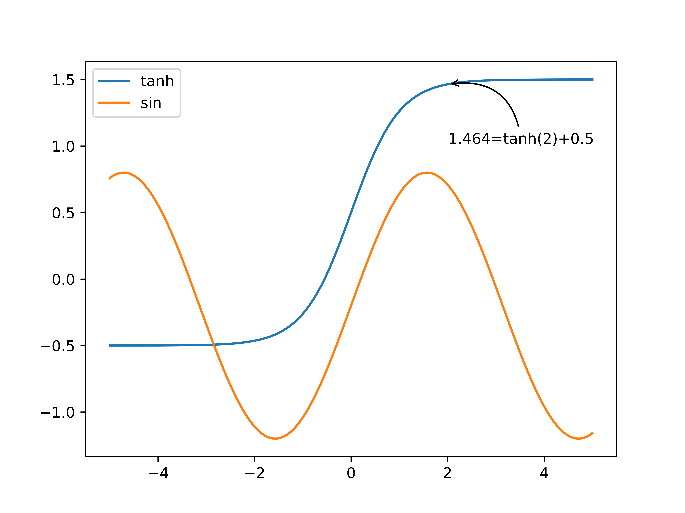

les différents paramètres pour les coordonnées:
|      Type       |                          Description                           |
| :-------------: | :------------------------------------------------------------: |
|  figure points  |            Points depuis le bas gauche de la figure            |
|  figure pixels  |            Pixels depuis le bas gauche de la figure            |
| figure fraction |         Une fraction depuis le bas gauche de la figure         |
|   axes points   |           Points depuis le coin bas gauche de l'axes           |
|   axes pixels   |           Pixels depuis le coin bas gauche de l'axes           |
|  axes fraction  |        Une fraction depuis le coin bas gauche de l'axes        |
|      data       |      Utilise le système de coordonnées de l'objet annoté       |
|      polar      | $(\theta, r)$, sinon utilise les coordonnées natives de `data` |

### Text
Le texte est une version simplifiée de `annotate`. Très utile quand notre texte n'est relié à aucune donnée spécifique.
```python
axe.text(x, y, text, fontdict, bbox)
```
`fontdict` est un dictionnaire pour une police d'écriture de type:
```python
font = {'family': 'serif',
        'color':  'darkred',
        'weight': 'normal',
        'size': 16,
        }
```
Le texte supporte également [$\LaTeX$](https://www.latex-project.org/).

### Grid
Cela correspond au quadrillé sur un graphe. quelques paramètres:

- `color`: Couleur des quadrillés
- `linestyle`: Style des quadrillés (eg: `-`, `dashed`)
- `linewidth`: Épaisseur des quadrillés
- `which`: Pour choisir quel `tick` on relie

Le `which` permet de choisir quel `tick` on relie. Soit ceux avec des chiffres qu'on appelle des `major` ou ceux intermédiaires sans chiffres `minor`.

```python
axe.grid(which='major', linestyle='-', linewidth='0.5', color='blue')
axe.grid(which='minor', linestyle=':', linewidth='0.5', color='black')
```
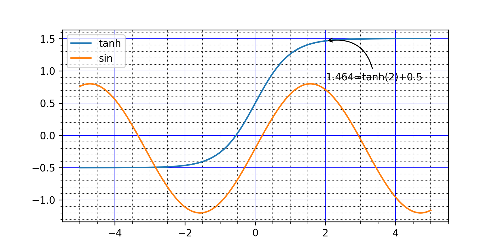

### Title
Pour ajouter un titre, on utilise `set_title(title)`. On peut aussi préciser l'endroit où le tout sera écrit via le paramètre `loc`.
```python
axe.set_title("Example", loc="left")
```
Si on veut avoir un titre qui englobe tout dans des subplots on utilise `suptitle`
```python
axe[0].set_title("tanh functions")
axe[1].set_title("sin functions")
fig.suptitle("tanh & sin function")
```
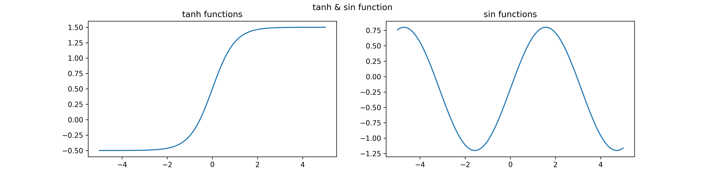
On peut utiliser des paramètres qu'on a déjà vu comme `fontdict`

### Subplots
Cela nous permet d'avoir plusieurs plot sur une seule figure via `plt.subplots(nrows=i, ncols=j)`

Pour éviter que tout se marche dessus, on appelle `plt.tight_layout()` pour espacer automatiquement les différents subplots

### Gridspec
Cela permet de customiser l'agencement d'une figure. C'est plus puissant que `subplots` car on peut controler la marge, la forme, ... de nos différents graphes. Pour l'utiliser il faut faire un nouvel import typiquement:

```python
from matplotlib.gridspec import GridSpec
```
Voici le résultat de `GridSpec` pour mieux le comprendre
```python
fig = plt.figure(dpi=300)

gs = GridSpec(2, 2, width_ratios=[1, 2], height_ratios=[4, 1])
ax1 = fig.add_subplot(gs[0])
```
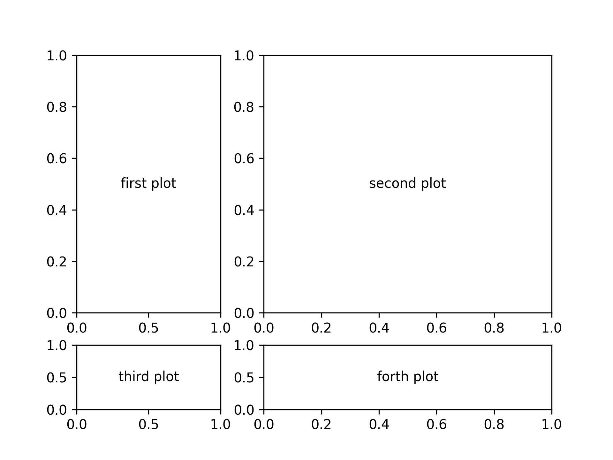
On peut aussi être plus fexible comme avec ce code
```python
gs = GridSpec(2, 2, width_ratios=[1, 2], height_ratios=[4, 1])
ax1 = fig.add_subplot(gs[0, 0])
ax1.text(0.5, 0.5, "first plot", verticalalignment='center', ha='center')
ax2 = fig.add_subplot(gs[:, 1])
ax2.text(0.5, 0.5, "second plot", verticalalignment='center', ha='center')
ax3 = fig.add_subplot(gs[1, 0])
ax3.text(0.5, 0.5, "third plot", verticalalignment='center', ha='center')
```
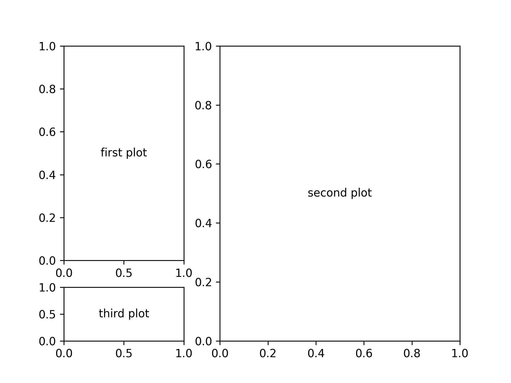
Il faut voir notre élément `GridSpec` comme une sorte de matrice. On va utiliser `add_subplot` et non `add_subplots` au pluriel. On précise l'endroit dans la matrice. Si on veut recouvrir plusieurs emplacement on peut faire  `[0:2, 1]` qui signifie qu'on recouvre les emplacements de 0 à 2 non inclus pour les lignes et on utilise la colonne 1. Si on veut recouvrir toute la ligne on fait simplement `[:, 1]` grâce à la syntaxe de python.

### Colors
Les différentes façons d'utiliser les couleurs en matplotlib:
|        Type        |                             Description                             |                    Exemple                     |
| :----------------: | :-----------------------------------------------------------------: | :--------------------------------------------: |
|      RGBA/RGB      | Format classique qui s'ecrit via un tuple à 4 ou 3 nombres de 0 à 1 | ``(0.1, 0.5, 1.0, 0.6)`` / ``(0.1, 0.5, 1.0)`` |
|        Hex         |            s'écrit sous la forme d'un string RGB ou RGBA            |            `#0F0F0F0F` / `#0F0F0F`             |
| 1 seul charactère  |          Une seule letter faisant référence à une couleur           |                 `"r"` / `"b"`                  |
|   Nom de couleur   |                      Nom en anglais de couleur                      |               `"red"` / `"blue"`               |
| Tableau de couleur |         Tableau de couleur faisant parti d'un dictionnaire          |         `"tab:purple"` / `"tab:cyan"`          |
| Un float en string |       une valeur entre 0 et 1 représentant un niveau de gris        |                    `"0.7"`                     | µ |


## How to Draw Different Types of Plots

### Line
On sait déjà que pour plot une fonction en matplotlib on réalise `axe.plot(x,y)`. Mais on peut y ajouter un tas de paramètres:
- ``x,y``: les données à plot
- ``fmt``: Le format pour le plot sous forme de string. (eg: `"ro"` pour des cercles rouges)
- ``label``: Un string qui peut être utilisé dans la légend
- ``linestyle``: Le style de ligne. `-`, `–`, `-.` ou `:`
- ``linewidth``: Épaisseur de la ligne
- ``marker``: Style du marqueur
- ``color``: Couleur du marqueur
```python
# On donne x,y
axe.plot(x, np.sin(x))
# On ne donne que des infos sur y
axe.plot(np.sin(x))
# On donne x,y puis encore x,y pour plot 2 lignes différentes
axe.plot(x, np.sin(x), x+1, np.sin(x+1))
```
Pour définir le style de ligne, on passe un string appelé un `fmt`. On définit un `fmt` comme:
```python
fmt = '[marker][line][color]'
```
Chacun des paramètres est optionnel.
#### Cheat sheet fmt
Type de Ligne
| Charactère |        Description        |
| :--------: | :-----------------------: |
|    ‘-’     |       ligne simple        |
|    ‘–’     |        ligne trait        |
|    ‘-.’    | ligne pointillée et trait |
|    ‘:’     |     ligne pointillée      |

Couleur
| Charactère | Description |
| :--------: | :---------: |
|    ‘b’     |    bleu     |
|    ‘g’     |    vert     |
|    ‘r’     |    rouge    |
|    ‘c’     |    cyan     |
|    ‘m’     |   magenta   |
|    ‘y’     |    jaune    |
|    ‘k’     |    noir     |
|    ‘w’     |    blanc    |

Marqueur utile
| Charactère |          Description           |
| :--------: | :----------------------------: |
|    ‘.’     |         marqueur point         |
|    ‘o’     |        marqueur cercle         |
|    ‘v’     | marqueur triangle vers le bas  |
|    ‘^’     | marqueur triangle vers le haut |
|    ‘*’     |        marqueur étoile         |
|    ‘s’     |         marqueur carré         |
|    ‘+’     |         marqueur plus          |
List complète [ici](https://matplotlib.org/stable/api/markers_api.html)
```python
import numpy as np
import matplotlib.pyplot as plt

x = np.linspace(-4, 4, 200)
fig, axe = plt.subplots(dpi=300)
axe.plot(x, np.sin(x), '--r' ,x, np.cos(x), '+y')
```
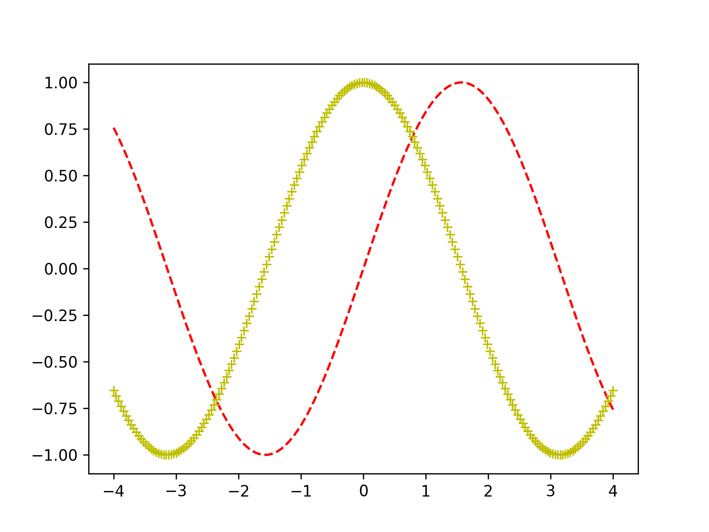

### Scatter
Cela est utilisé pour plot des points sur un graphe. Utile pour montrer des clusters de données. On remarquer qu'on utilise un marquer `"o"` et seulement 15 points.
```python
axe.plot(x, np.sin(x), "o")
```
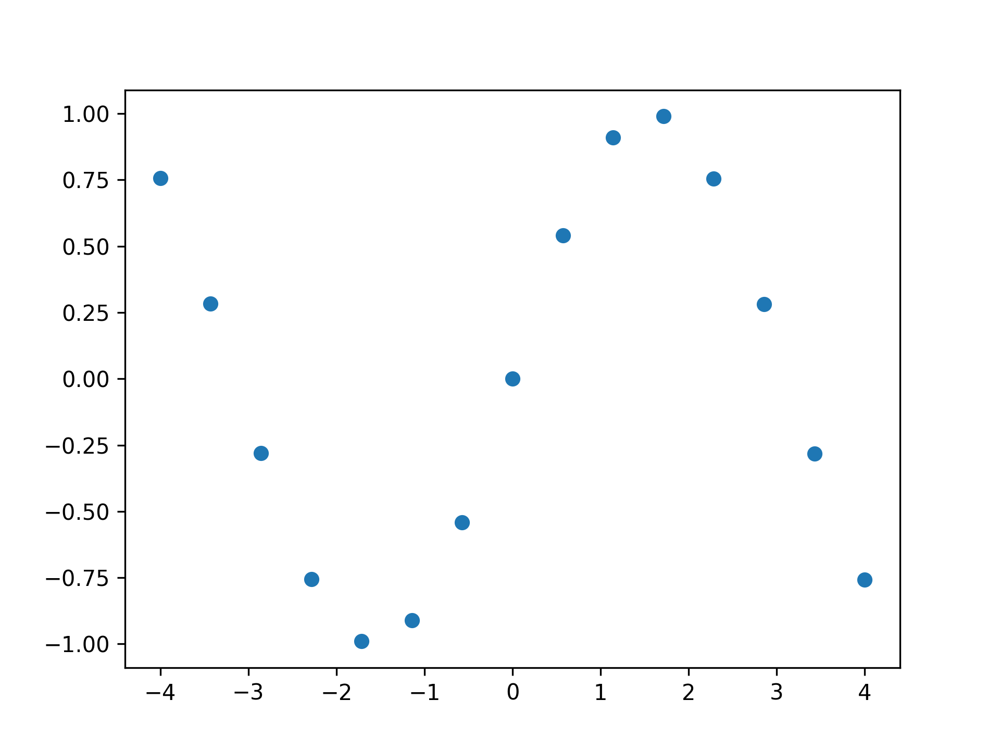

On peut utiliser `scatter(x,y)` qui est plus fin et possède plus de paramètre que le simple `plot(x,y)`:
- ``x,y``: Les données des points
- ``s``: Un scalaire ou un array qui représente la taille des marqueurs
- ``c``: Une couleur ou un array de couleur pour chaque point
- ``marker``: Pour la forme des marqueurs
- ``cmp``: Une façon de mapper les couleurs, utile seulement si c est un array de *float*
- ``alpha``: Pour la transparence

### Bar plot
Permet de plot des valeurs sous forme de batonnets. On utilise donc `bar()`
```python
label = ["Jan", "Feb", "Mar", "Apr", "May", "Jun", "Jul", "Aug"]
values = [100, 200, 300, 150, 440, 700, 350, 505]
axe.bar(label, values)
```
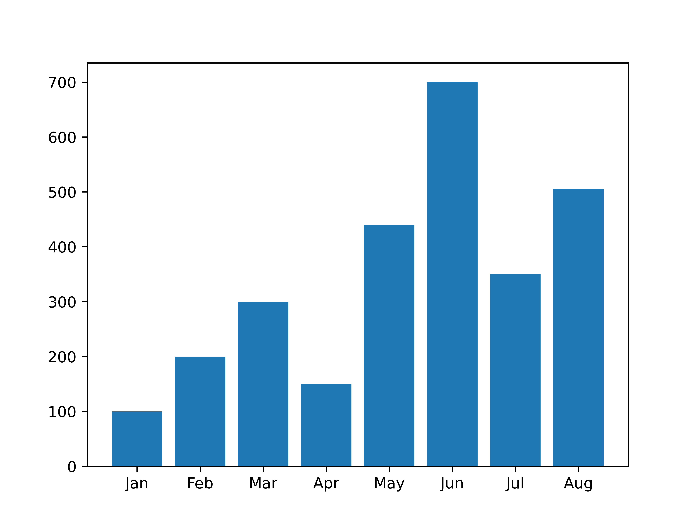
Les différents paramètres sont:
- ``x``: Controle les noms des scalaires en axe x. Souvent des arrays de string
- ``height``: Controle les valeurs / taille des batonnets
- ``width``: Change l'épaisseur des batonnets (de base $0.8$)
- ``bottom``: Change les coordonnées pour le bas des batonnets (de base $0$)
- ``color``: Change la couleur des batonnets
- ``orientation``: Change l'orientation des batonnets (de base vertical)

#### Avoir plusieurs types de batonnets

```python
label = ["Jan", "Feb", "Mar", "Apr", "May", "Jun", "Jul", "Aug"]
index = np.arange(len(label))
values1 = [100, 200, 300, 150, 440, 700, 350, 505]
values2 = [200, 250, 360, 180, 640, 780, 520, 580]
axe.bar(index, values1, width=0.3)
axe.bar(index+0.3, values2, width=0.3)
axe.set_xticks(index+0.15)
axe.set_xticklabels(label)
```
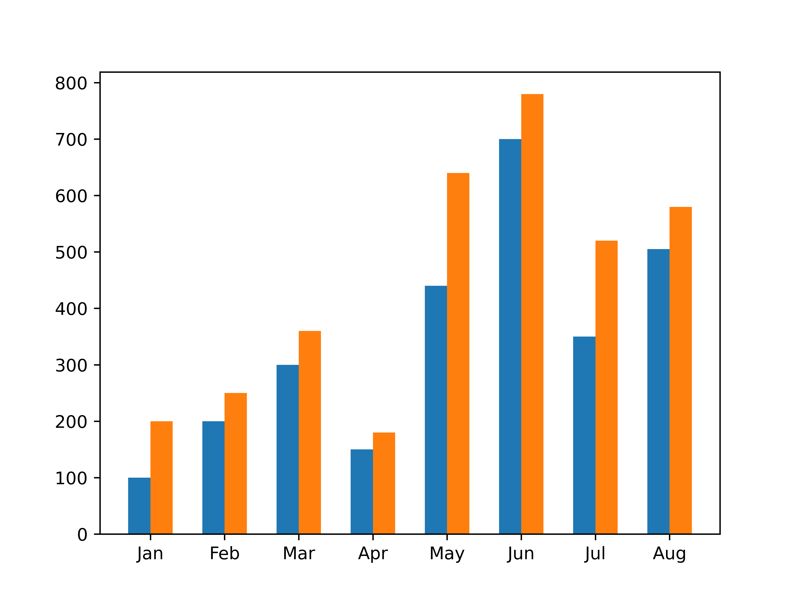
On voit ici qu'on va utiliser comme index un array qui ressemble à `[0, 1, 2, ...]` et on fait appraitre les mois en changeant le label via `set_xticklabels()`.

#### Stack et Horizontal
Pour stack on plot tout d'abord les batonnets d'en dessous `axe.bar(index, val1)` puis on met celle d'au-dessus via `axe.bar(index, val2, bottom=val1)`. `bottom` permet de rajouter un offset.

Pour avoir des batonnets à l'horizontal, on utilise `barh`. Tout est comme avant sauf que `bottom` $\rightarrow$ `left`.

### Error bar
Cela permet de montrer la variabilité d'une donnée et son incertitude. On utilise `errorbar()`, voici les paramètres les plus utiles:
- ``x,y``: Position des données
- ``xerr,yerr``: Permet de mettre les erreurs selon l'axe `x` ou `y`
- ``fmt``: Permet de choisir le format des lignes, ...
- ``ecolor``: Permet de choisir la couleur de la ligne d'erreur
- ``elinewidth``: Permet de choisir la largeur de la ligne d'erreur
- ``uplims,lolims``: Permet d'indiquer que l'erreur a des limites supérieures et/ou inférieures (de base `False`)
- ``capsize``: Permet de choisir la longueur de la petite barre d'erreur.

liste complète [ici](https://matplotlib.org/stable/api/_as_gen/matplotlib.pyplot.errorbar.html). Bien évidemment, on peut utiliser ces barres d'erreurs sur des batonnets comme ceci:
```python
axe.bar(np.arange(0, len(labels)), values, label=labels,
        yerr=yerr, alpha=0.7, ecolor='r', capsize=8)
```

### Histogram
Les histogrammes est un type de graphe important qui est utile pour rapidement visualiser des données. Il faut réaliser 3 étapes importantes.
1. Bin la portée des données
2. Diviser l'ensemble des données dans les *bin* correspondantes
3. Compter le nombre d'élément dans chaque *bin*
```python
import matplotlib.pyplot as plt
import numpy as np

rng = np.random.RandomState(42)
data = np.random.randn(2000)
fig, axe = plt.subplots(dpi=800)
axe.hist(data)
```
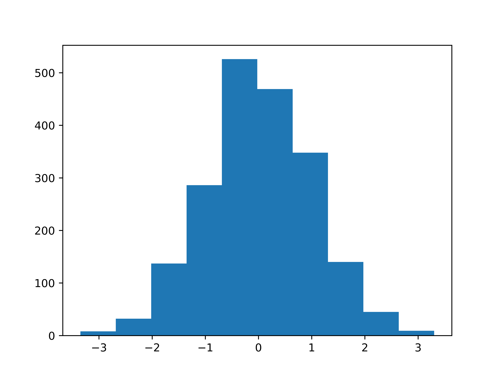

Les paramètres les plus importants de `hist()`:
- ``x``: Nos valeurs qui sont des listes de nombres ou plusieurs listes
- ``bins``: Si c'est un nombre, cela définit le nombre de division uniforme. Si c'est une liste, cela définit la limite à gauche de la première *bin* et de la dernière
- ``histtype``: Permet de changer le type d'histogramme, de base `bar`. Il existe aussi `step` et `stepfilled`
- ``density``: `True` ou `False` (de base `False`), permet de normaliser les résultats et de former une probabilité de densité
- ``cumulative``: Est soit `True` ou `-1`. Si `True` alors on cumule les données.

Parfois on veut dessiner plusieurs données (surtout des courbes de *best fit*). On va utiliser les données renvoyer par `hist()`. Un histogramme renvoie 2 choses qui nous sont utiles:
1. `n`: Les valeurs des *bin*
2. `bins`: Les limites des *bin*

(Cela retourne aussi `patches` mais pas utiles donc on lie ça à une varié non lié `_`)


```python
sigma = 1
mu = 0
fig, axe = plt.subplots(dpi=800)
data = np.random.normal(mu, sigma, 3000)
n, bins, _ = axe.hist(data, bins=40, density=True)
y = ((1 / (np.sqrt(2 * np.pi) * sigma)) *
     np.exp(-0.5 * (1 / sigma * (bins - mu))**2))
axe.plot(bins, y, '--', color='r')
```
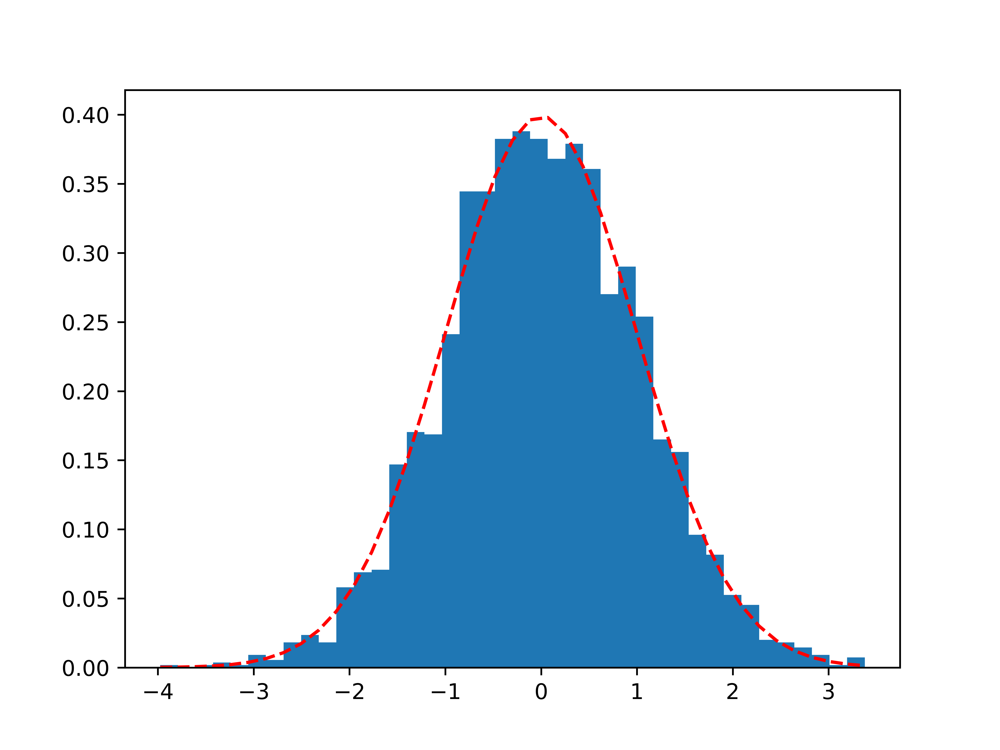

### Pie
Une autre façon commune de représenter les données est avec un *camembert*. On utilise la fonction `pie()` avec comme paramètres:
- ``x``: La liste des données qu'on veut représenter dans chaque morceau
- ``explode``: Mis sur `None` ou sur une liste de valeurs (de même taille que `x`). Représente de combien chaque morceau dévie du centre
- ``labels``: Nom pour chaque morceau
- `labeldistance`: Pour mieux placer le `labels`
- ``colors``: Soit `None` ou une liste de string indiquant la couleur de chaque morceau
- ``shadow``: ``True`` ou `False` (de base `False`). Ajoute une ombre
- ``counterclock``: ``True`` ou `False` (de base `True`). Indique la direction
- ``autopct``: Soit `None` ou un string qui permet d'indiquer un pourcentage. (eg: `"%.2f%%"` on indique qu'on veut un float 2 chiffres après la virgule et suivi d'un pourcentage)
- `pctdistance`: Pour mieux placer le `autocpt`
- `radius`: Indique le rayon pour creuser le centre
- `wedgeprops`: Impose la largeur des morceaux sous la forme d'un dictionnaire (eg: `dict(width=0.5)`)

```python
labels = ["Sun", "Moon", "Jupiter", "Venus", "Mars", "Mecury"]
values = [600, 100, 80, 60, 200, 330]

fig, axe = plt.subplots(dpi=800, figsize=(4, 4))
axe.pie(values, labels=labels)
```
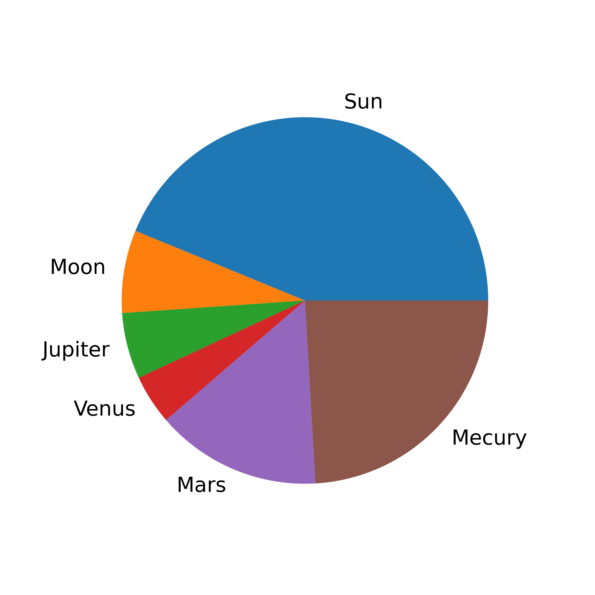
On peut plot plusieurs camemberts
```python
axe.pie(values, radius=1.5, wedgeprops=dict(width=0.5),
        autopct='%.2f%%', pctdistance=0.8, labels=labels, labeldistance=1.05)
# inner circle
axe.pie(values2, radius=1.5-0.5, wedgeprops=dict(width=0.5),
        autopct='%.2f%%', pctdistance=0.7, labels=labels2, labeldistance=0.3)
```
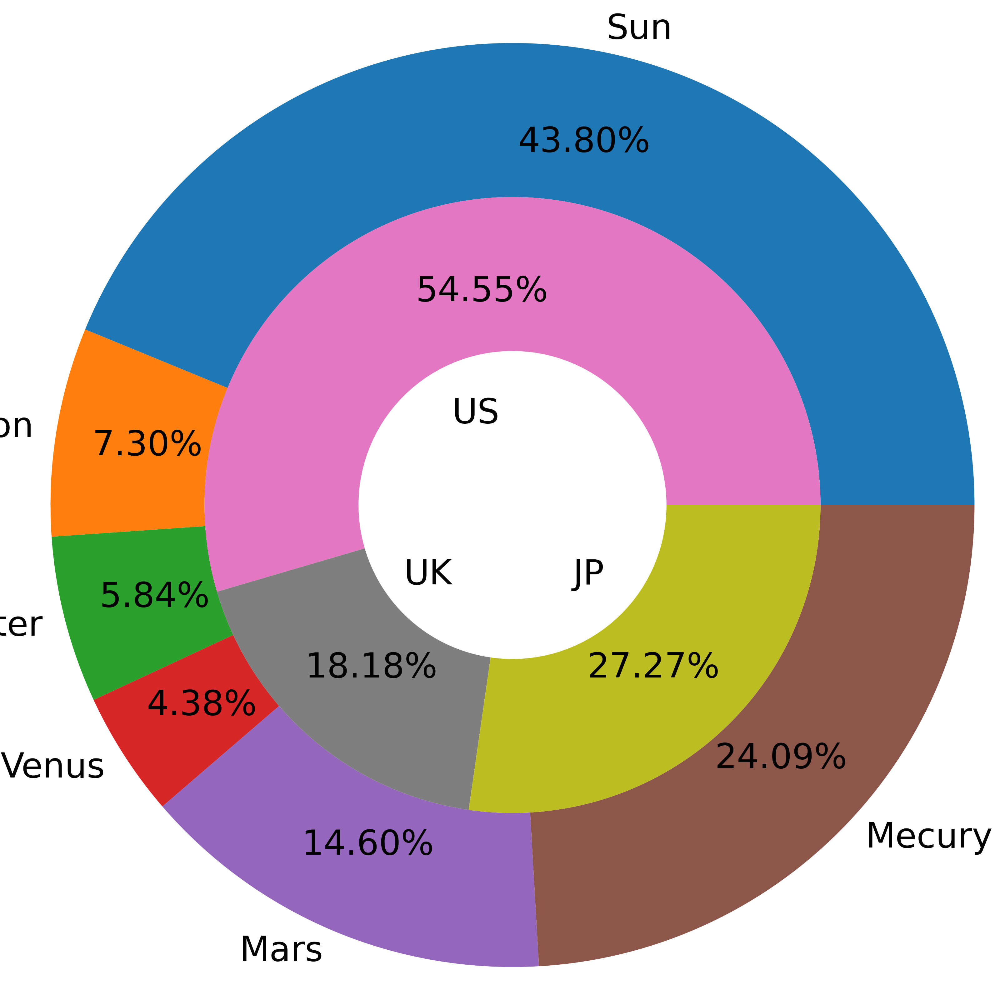

### Box
Ou *boite à moustache* en français. Permet de représenter des données de manière standardisée sur 5 nombres:
1. le minimum
2. le maximum
3. la médiane
4. le premier quartile
5. le troisième quartile

Pour plot cela, on utilise `boxplot()`, quelques paramètres:
- ``x``: Un array ou une séquence de vecteur
- ``vert``: Soit `True` ou `False` (de base `True`). Met la box à la verticale
- ``labels``: Pour attribuer un nom à chaque dataset
- ``notch``: Soit `True` ou `False` (de base `False`). Si `True`, on aura une encoche sur le boxplot
- ``widths``: Permet de chosir la largeur
- ``patch_artist``: Soit `True` ou `False` (de base `False`). Si ``False``, on aura une box avec l'artiste *Line2D*

Bon à savoir:
$$IQR = Q_3 - Q_1$$
$$Max = Q_3 + 1.5 \times IQR$$
$$Min = Q_1 - 1.5 \times IQR$$

```python
np.random.seed(42)
labels = ["Sun", "Moon", "Jupiter", "Venus"]
values = []
values.append(np.random.normal(100, 10, 200))
values.append(np.random.normal(90, 20, 200))
values.append(np.random.normal(120, 25, 200))
values.append(np.random.normal(130, 30, 200))

fig, axe = plt.subplots(dpi=800)
axe.boxplot(values, labels=labels)
```
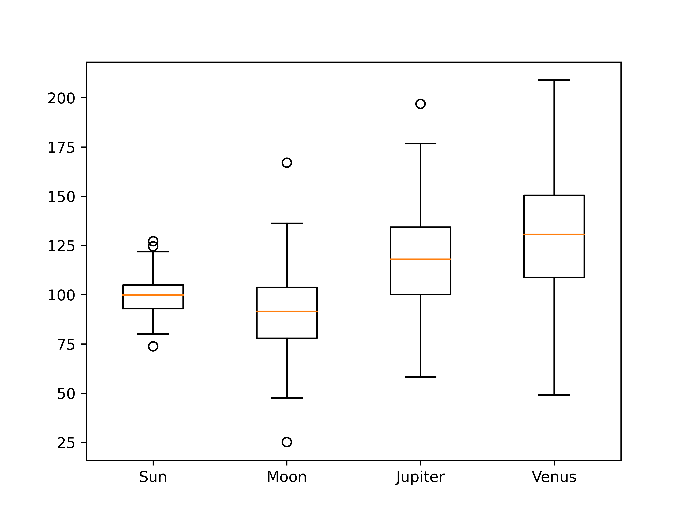

Pour Customiser le style de la boite on utilise 3 paramètres dans `boxplot()`:
1. ``boxprops``: Pour spécifier la boite
2. ``whiskerprops``: Pour changer la ligne qui relie le minimum et maximum aux quartiles
3. ``medianprops``: Pour changer la ligne médiane

```python
axe.boxplot(values, labels=labels,patch_artist=True,
            boxprops=dict(facecolor='teal', color='r'))
```

### Heatmap
C'est une représentation très utile pour montrer les relations entre les 2 variables. Il n'y a pas de *built-in* donc on doit utiliser `imshow()`.
```python
xlabels = ["dog", "cat", "bird", "fish", "horse"]
ylabels = ["red", "blue", "yellow", "pink", "green"]

values = np.array([[0.8, 1.2, 0.3, 0.9, 2.2],
                   [2.5, 0.1, 0.6, 1.6, 0.7],
                   [1.1, 1.3, 2.8, 0.5, 1.7],
                   [0.2, 1.2, 1.7, 2.2, 0.5],
                   [1.4, 0.7, 0.3, 1.8, 1.0]])

fig, axe = plt.subplots(dpi=300)
axe.set_xticks(np.arange(len(xlabels)))
axe.set_yticks(np.arange(len(ylabels)))
axe.set_xticklabels(xlabels)
axe.set_yticklabels(ylabels)
im = axe.imshow(values)
```
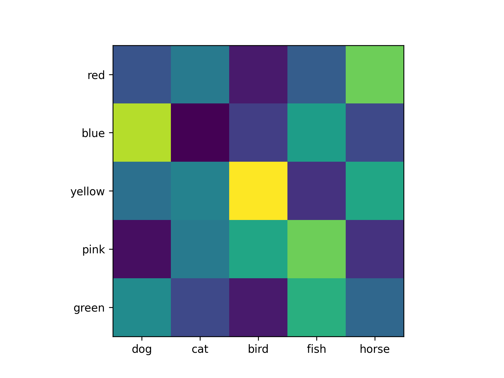

On peut ajouter des annotations au *heatmap*. Pour cela on doit faire cela de manière rudimentaire. On utilise donc `axe.text(i, j, values[i, j])`.
```python
for i in range(len(xlabels)):
    for j in range(len(ylabels)):
        text = axe.text(i, j, values[i, j],
                       horizontalalignment="center", verticalalignment="center", color="w")
```
Pour ajouter une barre de couleur à la heatmap on utilise `axe.figure.colorbar(im, ax=axe)`. `im = axe.imshow(values)` ce qui est la heatmap.

### Radar
C'est une figure sous forme de toile d'araignée. Ce n'est pas intégré de base donc on doit créer une fonction de radar. On utilise 5 étapes:
1. Il faut calculer les angles pour les valeurs de chaque catégorie.
2. On ajoute le premier objet au dernier et on fait le graphe se terminer
3. On utilise les coordonnées polaires
4. On plot simplement via `plot()`
5. On remplie les zones manquantes

```python
import math

labels = ["Sun", "Moon", "Jupiter", "Venus", "Mars", "Mecury"]
values = [10, 8, 4, 5, 2, 7]
values += values[:1]
angles = [n / float(len(labels)) * 2 * math.pi for n in range(len(labels))]
angles += angles[:1]

fig, axe = plt.subplots(subplot_kw=dict(polar=True), dpi=800)
axe.set_xticks(angles[:-1])
axe.set_xticklabels(labels, color='r')
axe.plot(angles, values)
axe.fill(angles, values, 'skyblue', alpha=0.4)
```
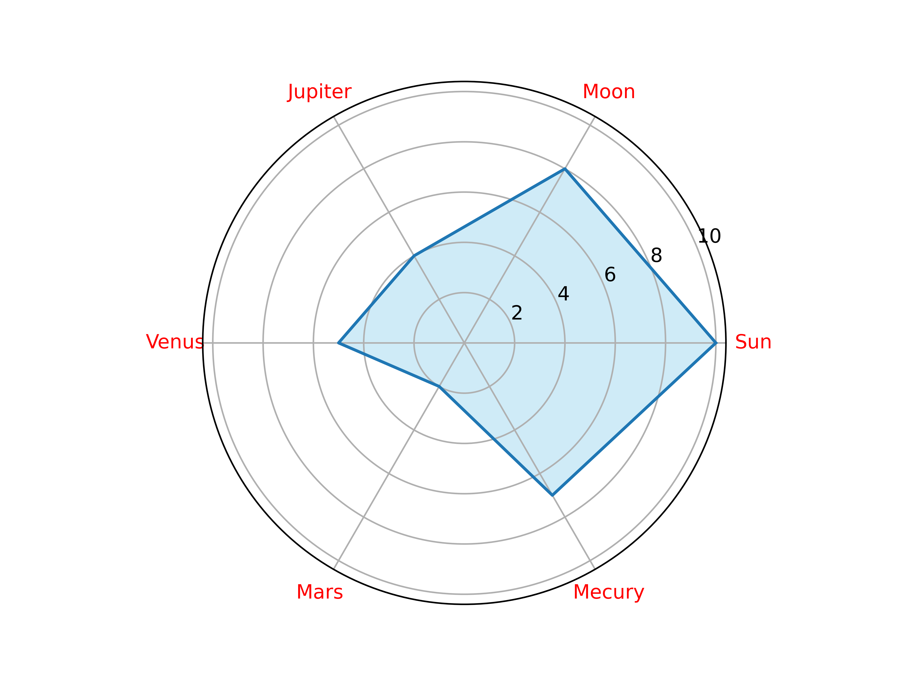

### Colorbar
Cela nous permet d'avoir une barre colorée pour nous aider à visualiser. On va l'utiliser en l'appelant depuis `fig` qui requiert 2 étapes:
1. `mappable`: `matplotlib.cm.ScalarMappable` décrit par le colorbar
2. `cax`: les axes de l'objet sur lequel les couleurs vont être dessiné

`matplotlib.cm.ScalarMappable` est une sorte de classe qui map des données scalaires en RGBA. On veut 2 paramètres:
1. `norm`: Une classe normalisée qui est un chiffre entre `0` et `1`
2. `cmap`: La colormap est utilisé pour mappé les données normalisées en RGBA. On en appelle via `plt.get_cmap()`

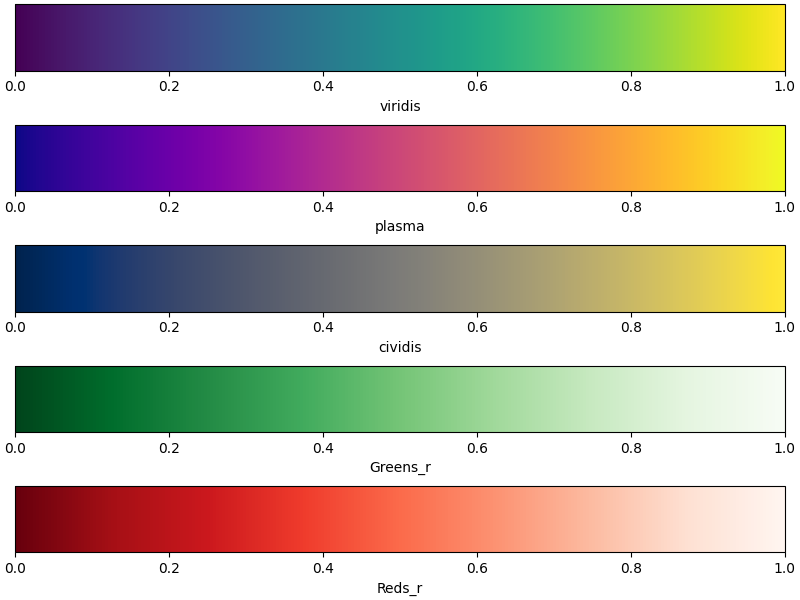

### 3D plot using Surface plot
On va surtout utiliser `plot_surface()` qui prend ces paramètres:
- ``X, Y, Z``: Array 2D 
- ``rcount``, ``ccount``: Le nombre maximum de samples à utiliser dans chaque direction
- ``cmap``: Utilise un colormap
- ``color``: Pour choisir la couleur des patch de surface
- ``norm``: Pour choisir la normalisation du colormap

Pour utiliser des `Axes3D` on doit importer `mpl_toolkits.mplot3d`. On doit utiliser `meshgrid()` pour avoir un set cartésien.
```python
import numpy as np
import matplotlib.pyplot as plt

X = np.linspace(-5, 5, 200)
Y = np.linspace(-5, 5, 200)

X, Y = np.meshgrid(X, Y)
Z = np.cos(np.sqrt(X**2 + Y**2))

axe = plt.figure().add_subplot(projection="3d")
axe.plot_surface(X, Y, Z)
```
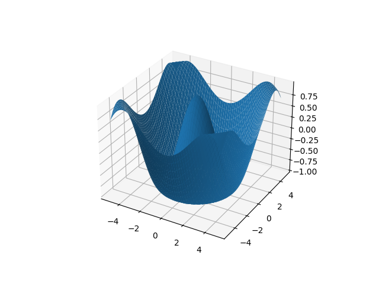

On peut aussi utiliser les color map via:
```python
surf = axe.plot_surface(X, Y, Z, cmap=plt.get_cmap("plasma"))
plt.colorbar(surf)
```

### Filling area between Two Curves
On va donc utiliser `fill_between()` pour réaliser ceci:
- ``x``: Les coordonnées en X des noeuds qui définissent la courbe
- ``y1``: Les coordonnées en Y des noeuds qui définissent la **première** courbe
- ``y2``: Les coordonnées en Y des noeuds qui définissent la **deuxième** courbe
- ``where``: Un array de booléens qui définissent les régions horizontales qui doivent être remplies. (example remplissez entre $x[i]$ et $x[i+1]$ si $where[i]$ et $where[i+1]$ est `True`)

```python
x = np.arange(0, 4, 0.01)
y1 = np.sin(x*np.pi)

fig, axe = plt.subplots(dpi=300)
axe.fill_between(x, y1, facecolor='g', alpha=0.6)
```

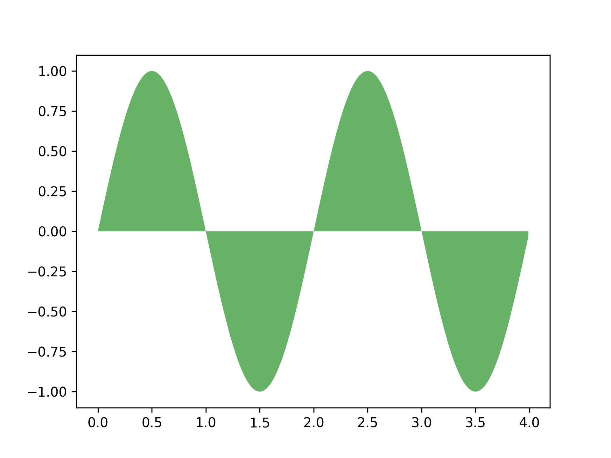

```python
axe.fill_between(x, y1, where=(y1 > 0), facecolor='g', alpha=0.6)
axe.fill_between(x, y1, where=(y1 < 0), facecolor='r', alpha=0.6)
```
Donc on peut remplir de manière conditionnelle.

On peut aussi dessinner des bandes de *confidences*. On doit faire ceci:
1. Préparer les données qu'on a besoin.
2. Utiliser un `polyfit`, on va faire une régression linéiare
3. Avoir une courbe d'estimation basée sur `a` et `b` via `y_est`
4. Avoir l'erreur via `y_err`
5. Dessiner le plot en utilisant `fill_between()`

```python
import matplotlib.pyplot as plt
import numpy as np

x = np.linspace(0, 10, 11)
y = [3.9, 4.4, 10.8, 10.3, 11.2, 13.1, 14.1,  9.9, 13.9, 15.1, 12.5]

a, b = np.polyfit(x, y, deg=1)
y_est = a * x + b
y_err = x.std() * np.sqrt(1/len(x) +
                          (x - x.mean())**2 / np.sum((x - x.mean())**2))

fig, ax = plt.subplots(dpi=800)
ax.plot(x, y_est, '-')
ax.fill_between(x, y_est - y_err, y_est + y_err, alpha=0.2)
ax.plot(x, y, 'o')
```

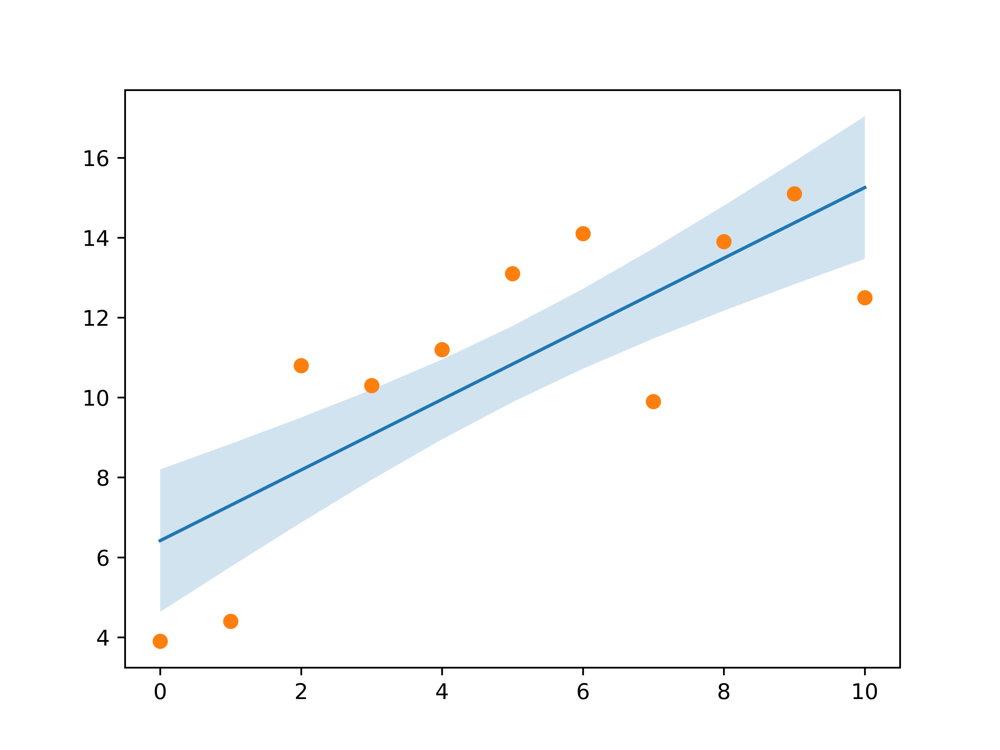

### Stem Plot
Très utile en ingé et déjà rencontré. On utilie `stem()` avec ces paramètres:
- ``x``: La position de la tige sur l'axe x
- ``y``: La position de la tige sur l'axe y
- ``linefmt``: Un string définissant les propriétés des lignes verticales
- ``markerfmt``: Un string définissant les propriétés des marqueurs à la tête des tiges
- ``bottom``: La position de la *baseline* sur l'axe y

```python
x = np.linspace(0.1, 2 * np.pi, 31)
y = np.exp(np.cos(x))

fig, axe = plt.subplots(dpi=800)
axe.stem(x, y)
```

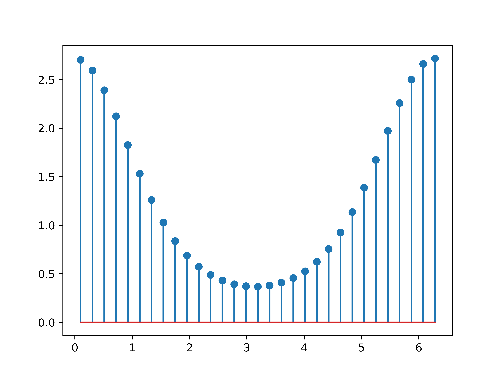

### Stack
Ce sont des courbes qui se superposent et qui montrent l'évolution. On utilise `stackplot()` qui prends comme argument:
- ``x``: Un array 1d de dimension $N$
- `y`: Un array 2d de dimension $(M \times N)$ ou une séquence d'arrays. Chacun de dimension $1 \times N$
```python
stackplot(x, y)
stackplot(x, y1, y2, y3)
```
- `baseline`: La méthode pour calculer la *baseline*:
  - `zero`: une baseline constante de zéro (par défaut)
  - `sym`: pour mettre le plot symmétrique autour de 0
  - `wiggle`: minimise la somme des pentes au carré
- `color`: Pour donner une liste de couleurs pour chaque data set

```python
np.random.seed(42)
x = [1, 2, 3, 4, 5]
y = [1, 2, 4, 8, 16]
y1 = y+np.random.randint(1,5,5)
y2 = y+np.random.randint(1,5,5)
y3 = y+np.random.randint(1,5,5)
y4 = y+np.random.randint(1,5,5)
y5 = y+np.random.randint(1,5,5)
y6 = y+np.random.randint(1,5,5)

labels = ["Jan", "Feb", "Mar", "Apr", "May"]

fig, axe = plt.subplots(dpi=800)
axe.stackplot(x, y, y1, y2, y3, y4, y5, y6,
              labels=["A", "B", "C", "D", "E", "F", "G"])
axe.set_xticks(x)
axe.set_xticklabels(labels)
axe.set_title("car sales from Jan to May")
axe.legend(loc='upper left')
```
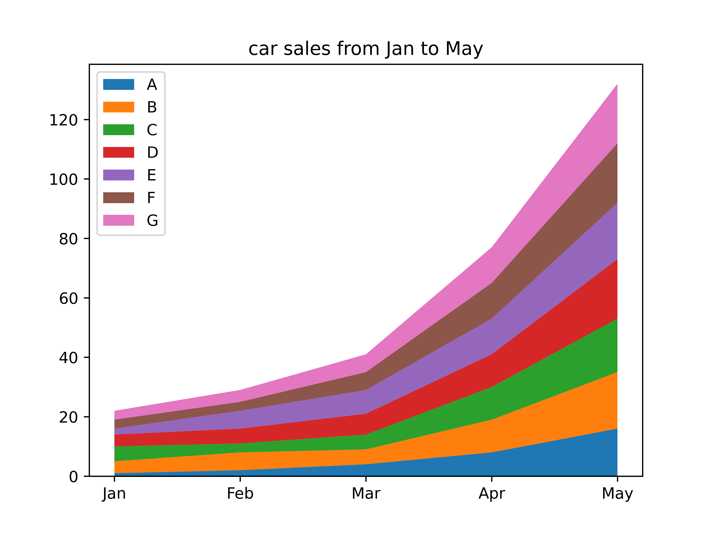