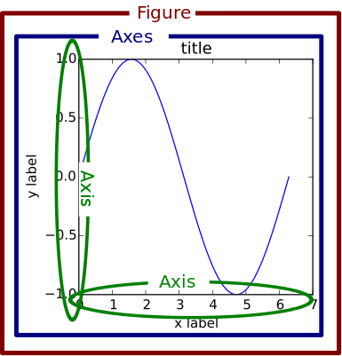
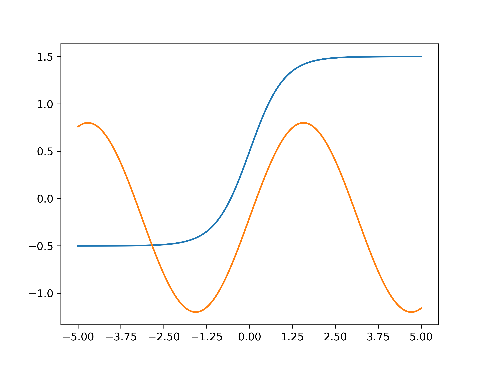

# Matplotlib for Python
- [Matplotlib for Python](#matplotlib-for-python)
  - [Basics of Matplotlib](#basics-of-matplotlib)
    - [How to draw Various plot elements](#how-to-draw-various-plot-elements)
      - [Tick](#tick)
      - [Spine](#spine)
      - [Legend](#legend)




## Basics of Matplotlib
- Figure: une sorte de toile groupant tous les graphes
- Axes: un graphe
- Axis: un axe sur un graphe
- Artist: est une collection d'objet qui font parti du graphe. (eg: *title, legend, axis, spine, grid, tick*)

### How to draw Various plot elements
3 façons de faire la même chose
```python
plt.plot(x,y)
```
```python
ax = plt.subplot()
ax.plot(x, y)
```
```python
fig = plt.figure(dpi=300)
ax = fig.add_subplot(111)
ax.plot(x, y)
```

#### Tick
Le tick est une marque sur l'axe des coordonnées.
- `which`: change x/y ou major/minor
- `color`: change la couleur
- `labelrotation`: rotation du label
- `width`: change la largeur en point
- `length`: change la longueur en point
- `direction`: choisis la direction du tick
  
utile pour changer le nombre de trait sur les axes


#### Spine
Les `spine` sont les lignes qui connectent les ticks aux un aux autres. Donc on a *top, bottom, left, right*

On peut déplacer la spine avec `set_position(position_type, amount)` Il y a différent `position_type`:
- `axes`: pour mettre le spine à des coordonnées 
- `data`: pour mettre le spine aux coordonnées des data
- `outward`: pour le mettre hors des data

#### Legend